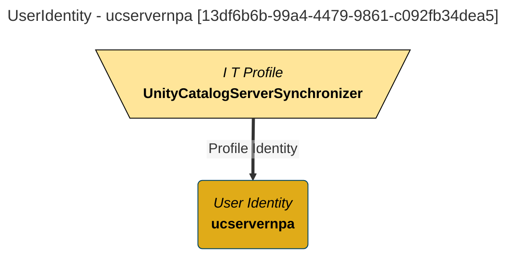

```mermaid
---
title: UserIdentity - ucservernpa [13df6b6b-99a4-4479-9861-c092fb34dea5]
---
flowchart TD
%%{init: {"flowchart": {"htmlLabels": false}} }%%

1@{ shape: rounded, label: "*User Identity*
**ucservernpa**"}
2@{ shape: trap-t, label: "*I T Profile*
**UnityCatalogServerSynchronizer**"}
2==>|"Profile Identity"|1
style 1 color:#000000, fill:#e0ab18, stroke:#004563
style 2 color:#000000, fill:#FFE599, stroke:#000000
```
