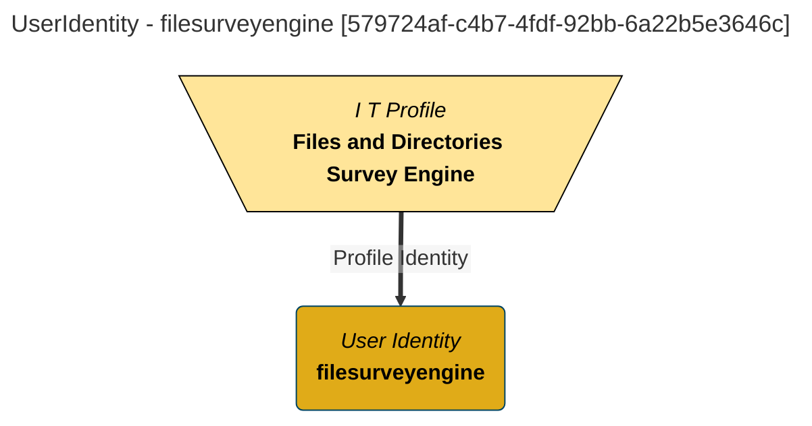

```mermaid
---
title: UserIdentity - filesurveyengine [579724af-c4b7-4fdf-92bb-6a22b5e3646c]
---
flowchart TD
%%{init: {"flowchart": {"htmlLabels": false}} }%%

1@{ shape: rounded, label: "*User Identity*
**filesurveyengine**"}
2@{ shape: trap-t, label: "*I T Profile*
**Files and Directories Survey Engine**"}
2==>|"Profile Identity"|1
style 1 color:#000000, fill:#e0ab18, stroke:#004563
style 2 color:#000000, fill:#FFE599, stroke:#000000
```
