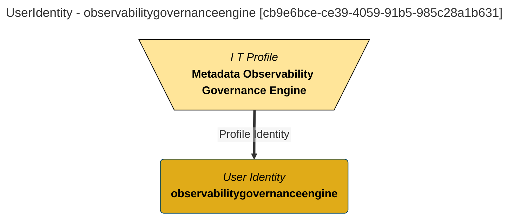

```mermaid
---
title: UserIdentity - observabilitygovernanceengine [cb9e6bce-ce39-4059-91b5-985c28a1b631]
---
flowchart TD
%%{init: {"flowchart": {"htmlLabels": false}} }%%

1@{ shape: rounded, label: "*User Identity*
**observabilitygovernanceengine**"}
2@{ shape: trap-t, label: "*I T Profile*
**Metadata Observability Governance Engine**"}
2==>|"Profile Identity"|1
style 1 color:#000000, fill:#e0ab18, stroke:#004563
style 2 color:#000000, fill:#FFE599, stroke:#000000
```
