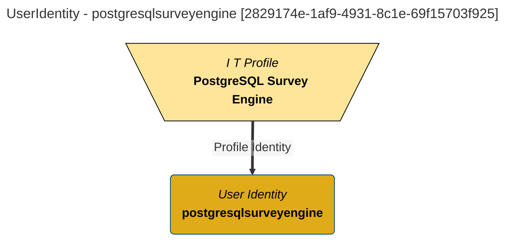

```mermaid
---
title: UserIdentity - postgresqlsurveyengine [2829174e-1af9-4931-8c1e-69f15703f925]
---
flowchart TD
%%{init: {"flowchart": {"htmlLabels": false}} }%%

1@{ shape: rounded, label: "*User Identity*
**postgresqlsurveyengine**"}
2@{ shape: trap-t, label: "*I T Profile*
**PostgreSQL Survey Engine**"}
2==>|"Profile Identity"|1
style 1 color:#000000, fill:#e0ab18, stroke:#004563
style 2 color:#000000, fill:#FFE599, stroke:#000000
```
