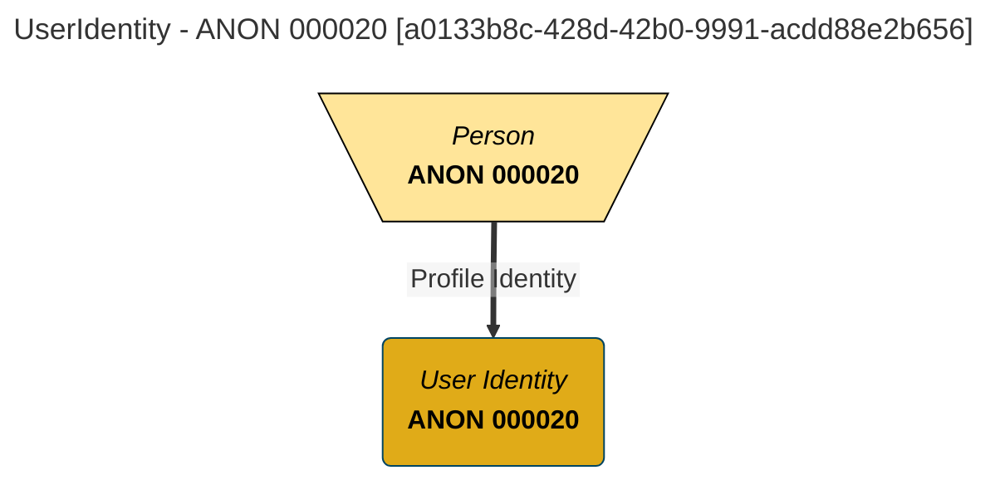

```mermaid
---
title: UserIdentity - ANON 000020 [a0133b8c-428d-42b0-9991-acdd88e2b656]
---
flowchart TD
%%{init: {"flowchart": {"htmlLabels": false}} }%%

1@{ shape: rounded, label: "*User Identity*
**ANON 000020**"}
2@{ shape: trap-t, label: "*Person*
**ANON 000020**"}
2==>|"Profile Identity"|1
style 1 color:#000000, fill:#e0ab18, stroke:#004563
style 2 color:#000000, fill:#FFE599, stroke:#000000
```
