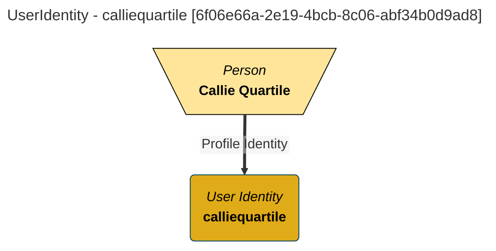

```mermaid
---
title: UserIdentity - calliequartile [6f06e66a-2e19-4bcb-8c06-abf34b0d9ad8]
---
flowchart TD
%%{init: {"flowchart": {"htmlLabels": false}} }%%

1@{ shape: rounded, label: "*User Identity*
**calliequartile**"}
2@{ shape: trap-t, label: "*Person*
**Callie Quartile**"}
2==>|"Profile Identity"|1
style 1 color:#000000, fill:#e0ab18, stroke:#004563
style 2 color:#000000, fill:#FFE599, stroke:#000000
```
