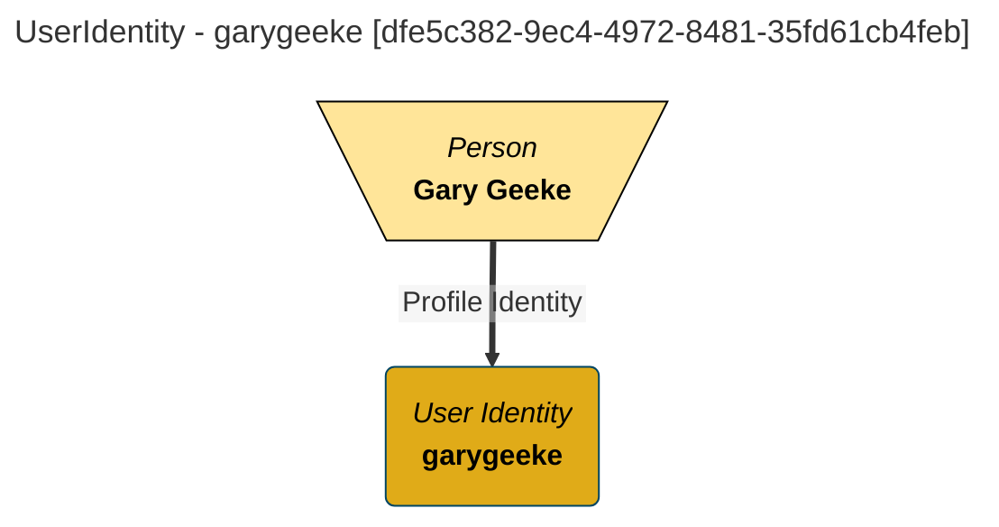

```mermaid
---
title: UserIdentity - garygeeke [dfe5c382-9ec4-4972-8481-35fd61cb4feb]
---
flowchart TD
%%{init: {"flowchart": {"htmlLabels": false}} }%%

1@{ shape: rounded, label: "*User Identity*
**garygeeke**"}
2@{ shape: trap-t, label: "*Person*
**Gary Geeke**"}
2==>|"Profile Identity"|1
style 1 color:#000000, fill:#e0ab18, stroke:#004563
style 2 color:#000000, fill:#FFE599, stroke:#000000
```
