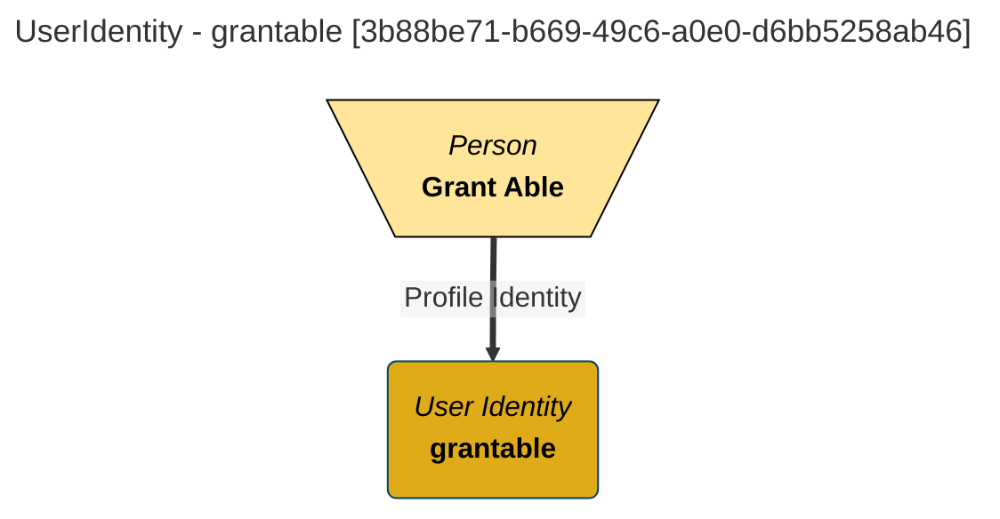

```mermaid
---
title: UserIdentity - grantable [3b88be71-b669-49c6-a0e0-d6bb5258ab46]
---
flowchart TD
%%{init: {"flowchart": {"htmlLabels": false}} }%%

1@{ shape: rounded, label: "*User Identity*
**grantable**"}
2@{ shape: trap-t, label: "*Person*
**Grant Able**"}
2==>|"Profile Identity"|1
style 1 color:#000000, fill:#e0ab18, stroke:#004563
style 2 color:#000000, fill:#FFE599, stroke:#000000
```
