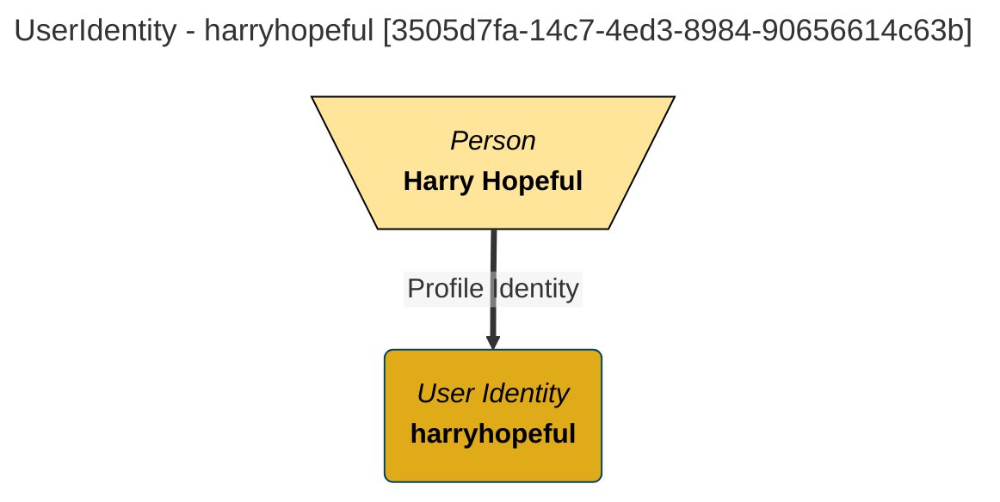

```mermaid
---
title: UserIdentity - harryhopeful [3505d7fa-14c7-4ed3-8984-90656614c63b]
---
flowchart TD
%%{init: {"flowchart": {"htmlLabels": false}} }%%

1@{ shape: rounded, label: "*User Identity*
**harryhopeful**"}
2@{ shape: trap-t, label: "*Person*
**Harry Hopeful**"}
2==>|"Profile Identity"|1
style 1 color:#000000, fill:#e0ab18, stroke:#004563
style 2 color:#000000, fill:#FFE599, stroke:#000000
```
