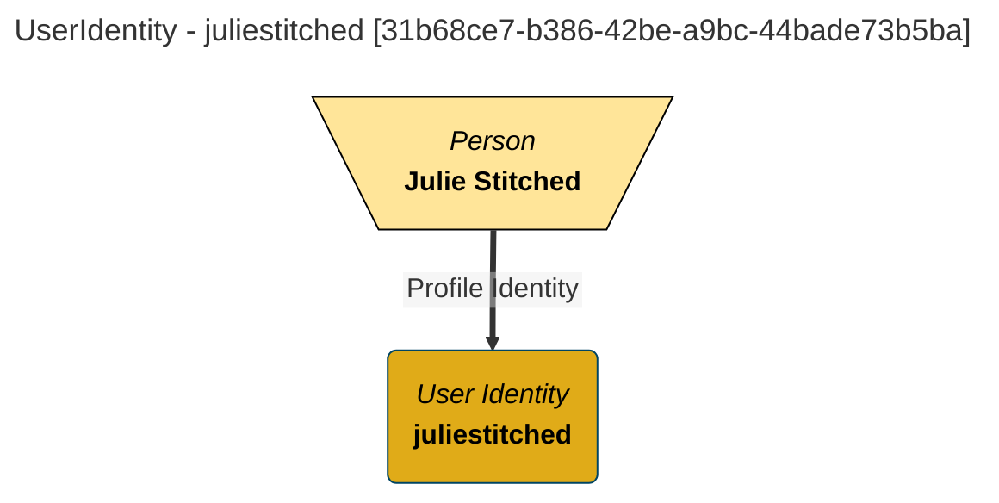

```mermaid
---
title: UserIdentity - juliestitched [31b68ce7-b386-42be-a9bc-44bade73b5ba]
---
flowchart TD
%%{init: {"flowchart": {"htmlLabels": false}} }%%

1@{ shape: rounded, label: "*User Identity*
**juliestitched**"}
2@{ shape: trap-t, label: "*Person*
**Julie Stitched**"}
2==>|"Profile Identity"|1
style 1 color:#000000, fill:#e0ab18, stroke:#004563
style 2 color:#000000, fill:#FFE599, stroke:#000000
```
