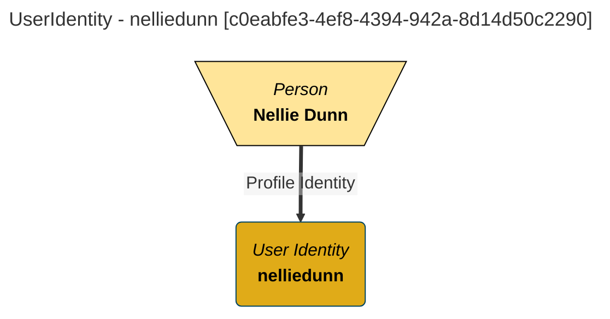

```mermaid
---
title: UserIdentity - nelliedunn [c0eabfe3-4ef8-4394-942a-8d14d50c2290]
---
flowchart TD
%%{init: {"flowchart": {"htmlLabels": false}} }%%

1@{ shape: rounded, label: "*User Identity*
**nelliedunn**"}
2@{ shape: trap-t, label: "*Person*
**Nellie Dunn**"}
2==>|"Profile Identity"|1
style 1 color:#000000, fill:#e0ab18, stroke:#004563
style 2 color:#000000, fill:#FFE599, stroke:#000000
```
