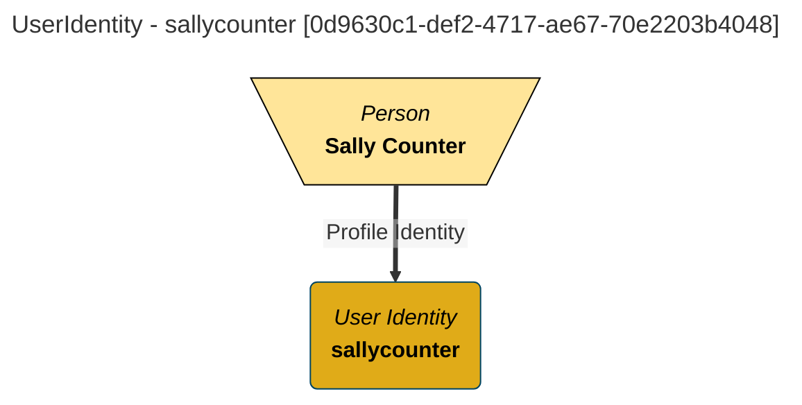

```mermaid
---
title: UserIdentity - sallycounter [0d9630c1-def2-4717-ae67-70e2203b4048]
---
flowchart TD
%%{init: {"flowchart": {"htmlLabels": false}} }%%

1@{ shape: rounded, label: "*User Identity*
**sallycounter**"}
2@{ shape: trap-t, label: "*Person*
**Sally Counter**"}
2==>|"Profile Identity"|1
style 1 color:#000000, fill:#e0ab18, stroke:#004563
style 2 color:#000000, fill:#FFE599, stroke:#000000
```
