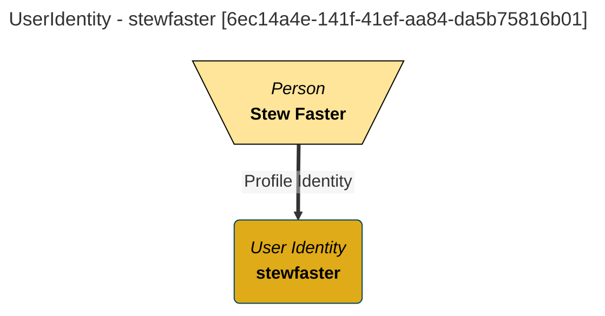

```mermaid
---
title: UserIdentity - stewfaster [6ec14a4e-141f-41ef-aa84-da5b75816b01]
---
flowchart TD
%%{init: {"flowchart": {"htmlLabels": false}} }%%

1@{ shape: rounded, label: "*User Identity*
**stewfaster**"}
2@{ shape: trap-t, label: "*Person*
**Stew Faster**"}
2==>|"Profile Identity"|1
style 1 color:#000000, fill:#e0ab18, stroke:#004563
style 2 color:#000000, fill:#FFE599, stroke:#000000
```
