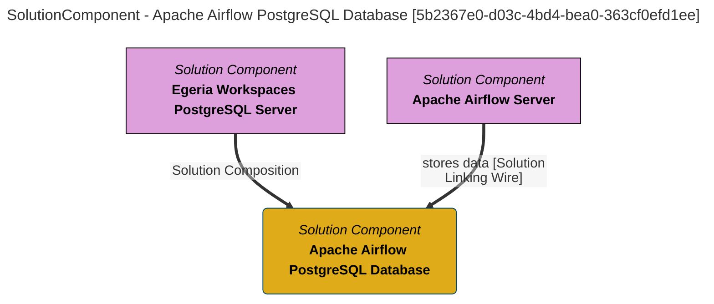

```mermaid
---
title: SolutionComponent - Apache Airflow PostgreSQL Database [5b2367e0-d03c-4bd4-bea0-363cf0efd1ee]
---
flowchart TD
%%{init: {"flowchart": {"htmlLabels": false}} }%%

1@{ shape: rounded, label: "*Solution Component*
**Apache Airflow PostgreSQL Database**"}
2@{ shape: rect, label: "*Solution Component*
**Egeria Workspaces PostgreSQL Server**"}
2==>|"Solution Composition"|1
3@{ shape: rect, label: "*Solution Component*
**Apache Airflow Server**"}
3==>|"stores data [Solution Linking Wire]"|1
style 1 color:#000000, fill:#e0ab18, stroke:#004563
style 2 color:#000000, fill:#dda0dd, stroke:#000000
style 3 color:#000000, fill:#dda0dd, stroke:#000000
click 1 "https://www.postgresql.org/" "Click for more documentation" _blank
click 2 "https://www.postgresql.org/" "Click for more documentation" _blank
click 3 "https://airflow.apache.org/" "Click for more documentation" _blank
```
> Apache Airflow PostgreSQL Database: This database supports the catalog storage for Apache Airflow. (Extracted from 6.0-SNAPSHOT)
