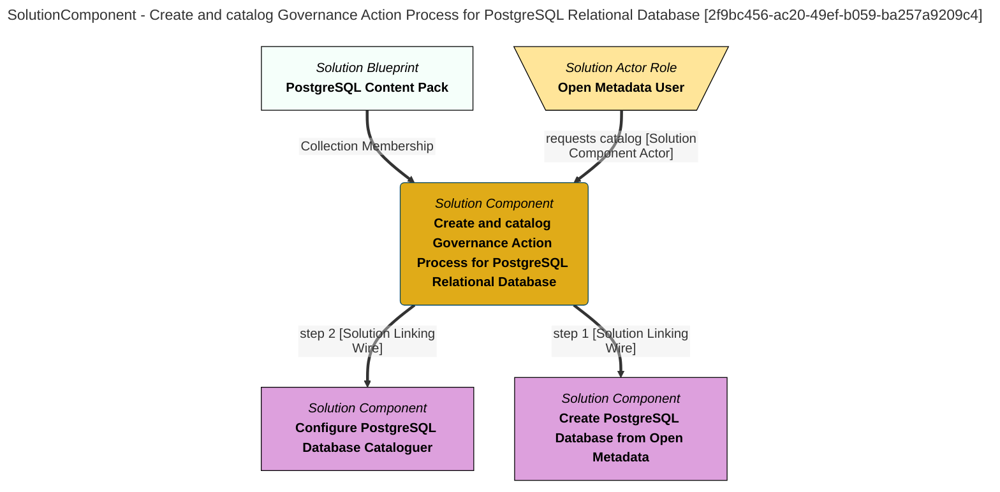

> Create and catalog Governance Action Process for PostgreSQL Relational Database: Create a PostgreSQL Relational Database and configure an integration connector to catalog its contents. (Extracted from 6.0-SNAPSHOT)
