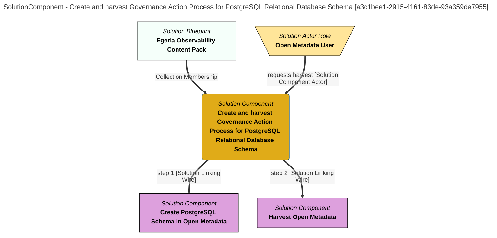

```mermaid
---
title: SolutionComponent - Create and harvest Governance Action Process for PostgreSQL Relational Database Schema [a3c1bee1-2915-4161-83de-93a359de7955]
---
flowchart TD
%%{init: {"flowchart": {"htmlLabels": false}} }%%

1@{ shape: rounded, label: "*Solution Component*
**Create and harvest Governance Action Process for PostgreSQL Relational Database Schema**"}
2@{ shape: rect, label: "*Solution Blueprint*
**Egeria Observability Content Pack**"}
2==>|"Collection Membership"|1
3@{ shape: trap-t, label: "*Solution Actor Role*
**Open Metadata User**"}
3==>|"requests harvest [Solution Component Actor]"|1
4@{ shape: rect, label: "*Solution Component*
**Create PostgreSQL Schema in Open Metadata**"}
1==>|"step 1 [Solution Linking Wire]"|4
5@{ shape: rect, label: "*Solution Component*
**Harvest Open Metadata**"}
1==>|"step 2 [Solution Linking Wire]"|5
style 1 color:#000000, fill:#e0ab18, stroke:#004563
style 2 color:#000000, fill:#f5fffa, stroke:#000000
style 3 color:#000000, fill:#FFE599, stroke:#000000
style 4 color:#000000, fill:#dda0dd, stroke:#000000
style 5 color:#000000, fill:#dda0dd, stroke:#000000
click 4 "https://egeria-project.org/concepts/governance-action-type/" "Click for more documentation" _blank
click 5 "https://egeria-project.org/concepts/governance-action-type/" "Click for more documentation" _blank
```
