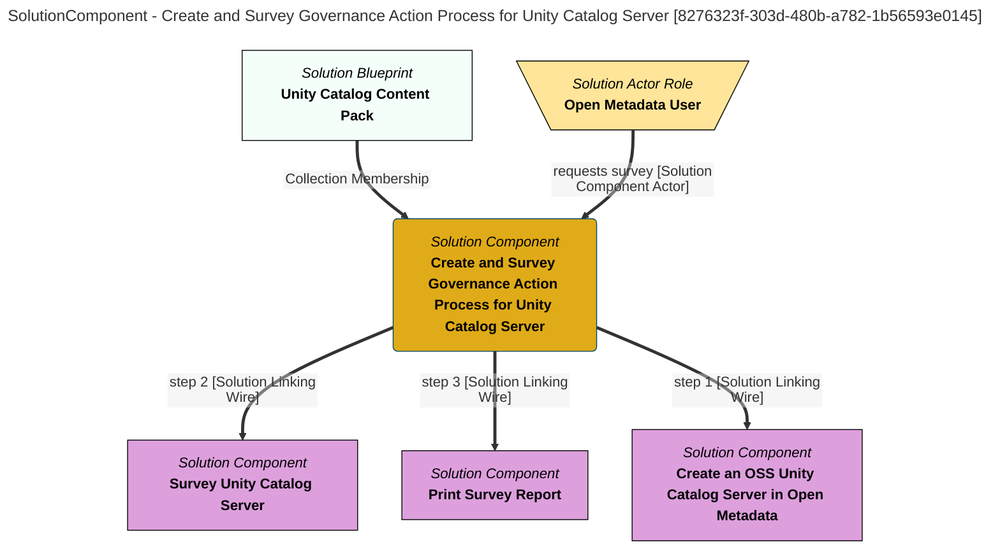

```mermaid
---
title: SolutionComponent - Create and Survey Governance Action Process for Unity Catalog Server [8276323f-303d-480b-a782-1b56593e0145]
---
flowchart TD
%%{init: {"flowchart": {"htmlLabels": false}} }%%

1@{ shape: rounded, label: "*Solution Component*
**Create and Survey Governance Action Process for Unity Catalog Server**"}
2@{ shape: rect, label: "*Solution Blueprint*
**Unity Catalog Content Pack**"}
2==>|"Collection Membership"|1
3@{ shape: trap-t, label: "*Solution Actor Role*
**Open Metadata User**"}
3==>|"requests survey [Solution Component Actor]"|1
4@{ shape: rect, label: "*Solution Component*
**Survey Unity Catalog Server**"}
1==>|"step 2 [Solution Linking Wire]"|4
5@{ shape: rect, label: "*Solution Component*
**Print Survey Report**"}
1==>|"step 3 [Solution Linking Wire]"|5
6@{ shape: rect, label: "*Solution Component*
**Create an OSS Unity Catalog Server in Open Metadata**"}
1==>|"step 1 [Solution Linking Wire]"|6
style 1 color:#000000, fill:#e0ab18, stroke:#004563
style 2 color:#000000, fill:#f5fffa, stroke:#000000
style 3 color:#000000, fill:#FFE599, stroke:#000000
style 4 color:#000000, fill:#dda0dd, stroke:#000000
style 5 color:#000000, fill:#dda0dd, stroke:#000000
style 6 color:#000000, fill:#dda0dd, stroke:#000000
click 1 "https://egeria-project.org/egeria-solutions/leveraging-unity-catalog/overview/" "Click for more documentation" _blank
click 4 "https://egeria-project.org/concepts/governance-action-type/" "Click for more documentation" _blank
click 5 "https://egeria-project.org/concepts/governance-action-type/" "Click for more documentation" _blank
click 6 "https://egeria-project.org/concepts/governance-action-type/" "Click for more documentation" _blank
```
> Create and Survey Governance Action Process for Unity Catalog Server: Create a Unity Catalog Server, run a survey against it, and print out the resulting report. (Extracted from 6.0-SNAPSHOT)
