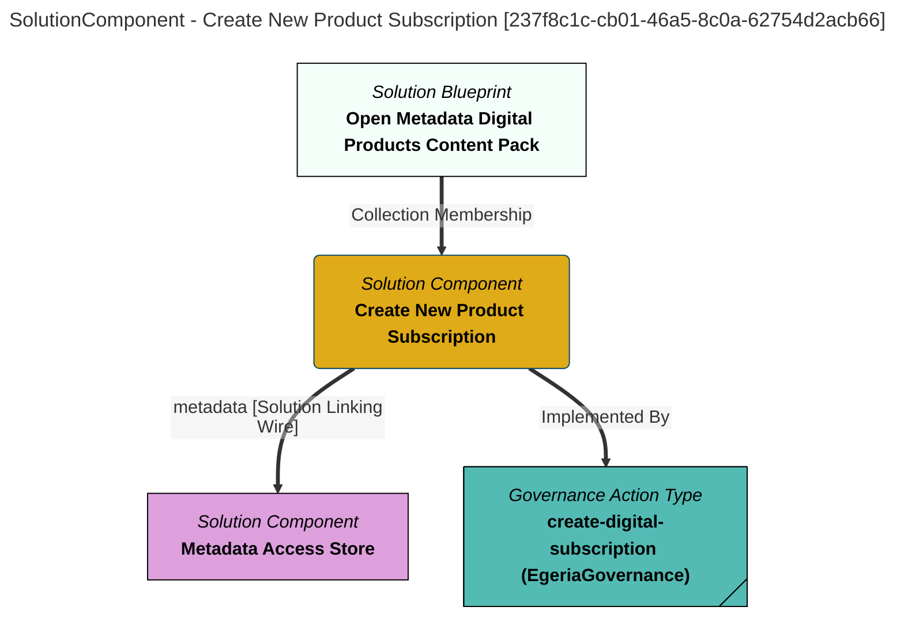

```mermaid
---
title: SolutionComponent - Create New Product Subscription [237f8c1c-cb01-46a5-8c0a-62754d2acb66]
---
flowchart TD
%%{init: {"flowchart": {"htmlLabels": false}} }%%

1@{ shape: rounded, label: "*Solution Component*
**Create New Product Subscription**"}
2@{ shape: rect, label: "*Solution Blueprint*
**Open Metadata Digital Products Content Pack**"}
2==>|"Collection Membership"|1
3@{ shape: rect, label: "*Solution Component*
**Metadata Access Store**"}
1==>|"metadata [Solution Linking Wire]"|3
4@{ shape: tag-rect, label: "*Governance Action Type*
**create-digital-subscription (EgeriaGovernance)**"}
1==>|"Implemented By"|4
style 1 color:#000000, fill:#e0ab18, stroke:#004563
style 2 color:#000000, fill:#f5fffa, stroke:#000000
style 3 color:#000000, fill:#dda0dd, stroke:#000000
style 4 color:#000000, fill:#53bbb4, stroke:#000000
click 1 "https://egeria-project.org/concepts/governance-action-type/" "Click for more documentation" _blank
click 3 "https://egeria-project.org/concepts/metadata-access-store/" "Click for more documentation" _blank
```
> Create New Product Subscription: The process of setting up the subscription for a new consumer. (Extracted from 6.0-SNAPSHOT)
