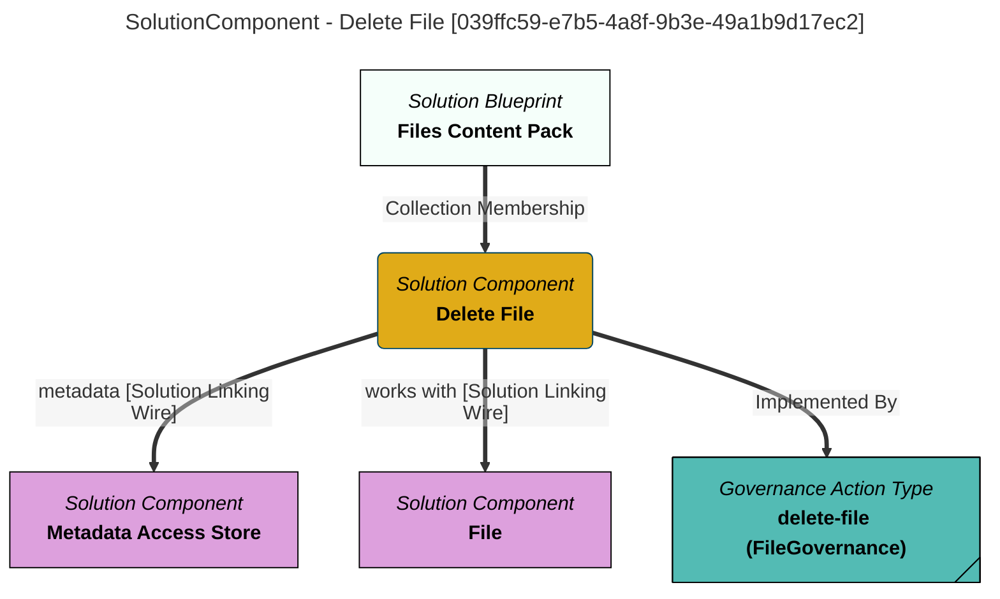

```mermaid
---
title: SolutionComponent - Delete File [039ffc59-e7b5-4a8f-9b3e-49a1b9d17ec2]
---
flowchart TD
%%{init: {"flowchart": {"htmlLabels": false}} }%%

1@{ shape: rounded, label: "*Solution Component*
**Delete File**"}
2@{ shape: rect, label: "*Solution Blueprint*
**Files Content Pack**"}
2==>|"Collection Membership"|1
3@{ shape: rect, label: "*Solution Component*
**Metadata Access Store**"}
1==>|"metadata [Solution Linking Wire]"|3
4@{ shape: rect, label: "*Solution Component*
**File**"}
1==>|"works with [Solution Linking Wire]"|4
5@{ shape: tag-rect, label: "*Governance Action Type*
**delete-file (FileGovernance)**"}
1==>|"Implemented By"|5
style 1 color:#000000, fill:#e0ab18, stroke:#004563
style 2 color:#000000, fill:#f5fffa, stroke:#000000
style 3 color:#000000, fill:#dda0dd, stroke:#000000
style 4 color:#000000, fill:#dda0dd, stroke:#000000
style 5 color:#000000, fill:#53bbb4, stroke:#000000
click 1 "https://egeria-project.org/concepts/governance-action-type/" "Click for more documentation" _blank
click 3 "https://egeria-project.org/concepts/metadata-access-store/" "Click for more documentation" _blank
click 4 "https://egeria-project.org/types/2/0220-Files-and-Folders/" "Click for more documentation" _blank
```
> Delete File: Deletes a file and deletes the associated ope metadata element. (Extracted from 6.0-SNAPSHOT)
