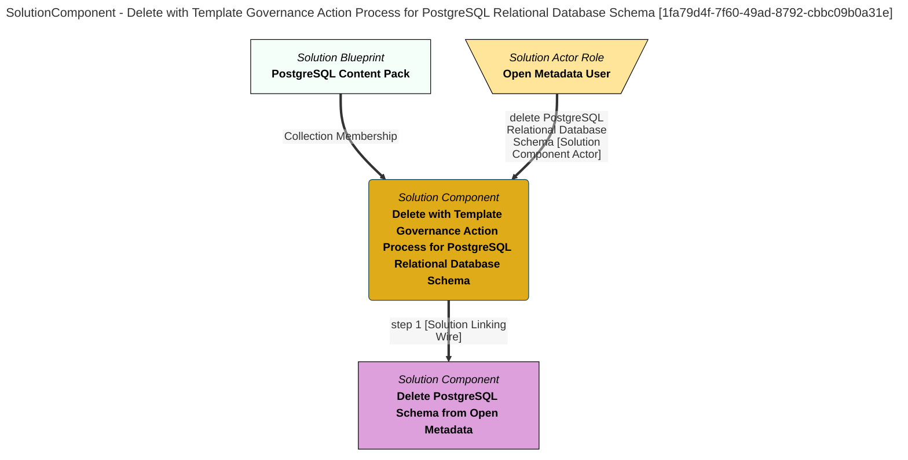

> Delete with Template Governance Action Process for PostgreSQL Relational Database Schema: Delete the asset for PostgreSQL Relational Database Schema using the same template properties that were used to create it.  This will delete all of the metadata anchored to the asset and relationships to other entities such as the catalog target relationships. (Extracted from 6.0-SNAPSHOT)
