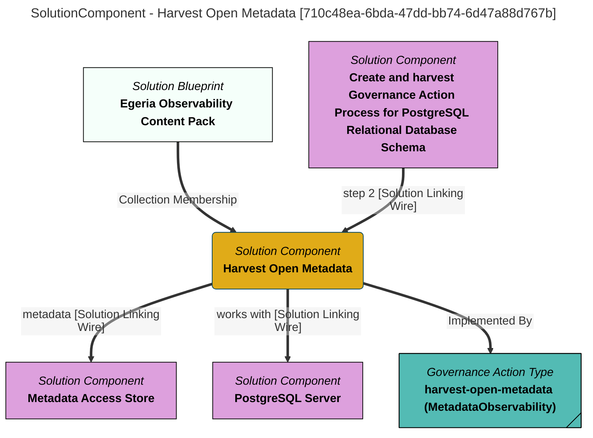

```mermaid
---
title: SolutionComponent - Harvest Open Metadata [710c48ea-6bda-47dd-bb74-6d47a88d767b]
---
flowchart TD
%%{init: {"flowchart": {"htmlLabels": false}} }%%

1@{ shape: rounded, label: "*Solution Component*
**Harvest Open Metadata**"}
2@{ shape: rect, label: "*Solution Blueprint*
**Egeria Observability Content Pack**"}
2==>|"Collection Membership"|1
3@{ shape: rect, label: "*Solution Component*
**Metadata Access Store**"}
1==>|"metadata [Solution Linking Wire]"|3
4@{ shape: rect, label: "*Solution Component*
**PostgreSQL Server**"}
1==>|"works with [Solution Linking Wire]"|4
5@{ shape: rect, label: "*Solution Component*
**Create and harvest Governance Action Process for PostgreSQL Relational Database Schema**"}
5==>|"step 2 [Solution Linking Wire]"|1
6@{ shape: tag-rect, label: "*Governance Action Type*
**harvest-open-metadata (MetadataObservability)**"}
1==>|"Implemented By"|6
style 1 color:#000000, fill:#e0ab18, stroke:#004563
style 2 color:#000000, fill:#f5fffa, stroke:#000000
style 3 color:#000000, fill:#dda0dd, stroke:#000000
style 4 color:#000000, fill:#dda0dd, stroke:#000000
style 5 color:#000000, fill:#dda0dd, stroke:#000000
style 6 color:#000000, fill:#53bbb4, stroke:#000000
click 1 "https://egeria-project.org/concepts/governance-action-type/" "Click for more documentation" _blank
click 3 "https://egeria-project.org/concepts/metadata-access-store/" "Click for more documentation" _blank
click 4 "https://www.postgresql.org/" "Click for more documentation" _blank
```
