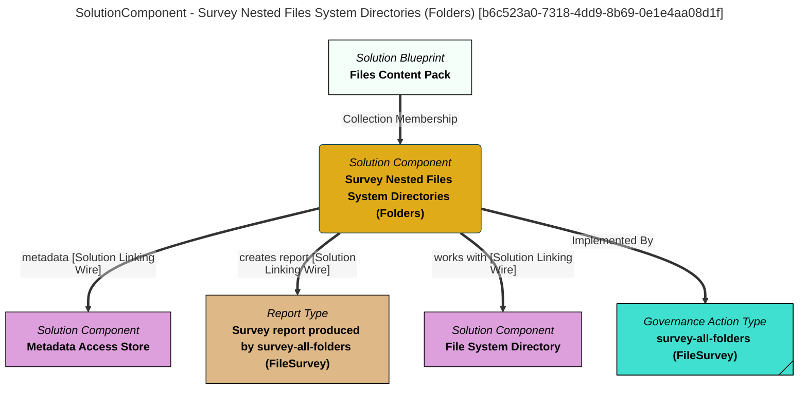

> Survey Nested Files System Directories (Folders): Starting from a particular directory, navigate through the hierarchy of nested directories in a file system and create a survey report that includes a summary of the files found in each directory. (Extracted from 6.0-SNAPSHOT)
