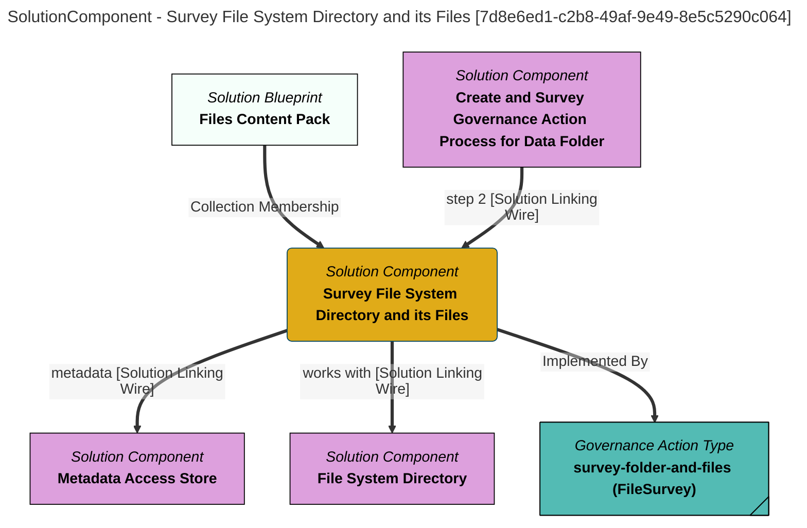

> Survey File System Directory and its Files: Create a survey report that characterises the files in a requested directory (folder) on a file system along with a summary of the directory itself.  Nested directories are ignored. (Extracted from 6.0-SNAPSHOT)
