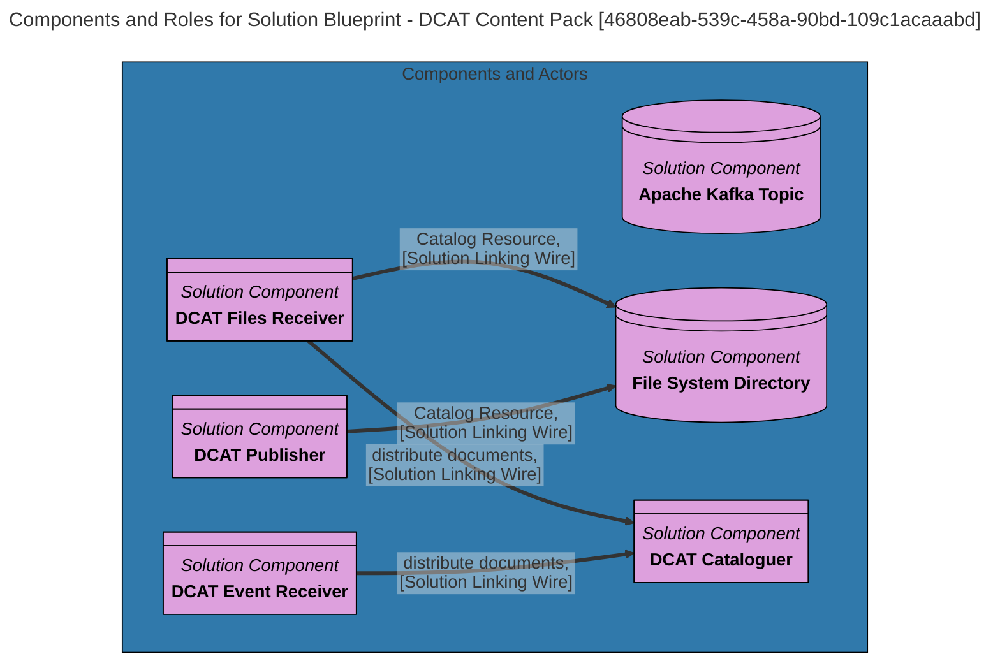

```mermaid
---
title: Components and Roles for Solution Blueprint - DCAT Content Pack [46808eab-539c-458a-90bd-109c1acaaabd]
---
flowchart TD
%%{init: {"flowchart": {"htmlLabels": false}} }%%

subgraph 1 [Components and Actors]
2@{ shape: div-rect, label: "*Solution Component*
**DCAT Files Receiver**"}
3@{ shape: lin-cyl, label: "*Solution Component*
**Apache Kafka Topic**"}
4@{ shape: lin-cyl, label: "*Solution Component*
**File System Directory**"}
5@{ shape: div-rect, label: "*Solution Component*
**DCAT Publisher**"}
6@{ shape: div-rect, label: "*Solution Component*
**DCAT Cataloguer**"}
7@{ shape: div-rect, label: "*Solution Component*
**DCAT Event Receiver**"}
2==>|"Catalog Resource,
[Solution Linking Wire]"|4
2==>|"distribute documents,
[Solution Linking Wire]"|6
5==>|"Catalog Resource,
[Solution Linking Wire]"|4
7==>|"distribute documents,
[Solution Linking Wire]"|6
end
style 1 color:#FFFFFF, fill:#3079ab, stroke:#000000
style 2 color:#000000, fill:#DDA0DD, stroke:#000000
style 3 color:#000000, fill:#DDA0DD, stroke:#000000
style 4 color:#000000, fill:#DDA0DD, stroke:#000000
style 5 color:#000000, fill:#DDA0DD, stroke:#000000
style 6 color:#000000, fill:#DDA0DD, stroke:#000000
style 7 color:#000000, fill:#DDA0DD, stroke:#000000
click 2 "https://egeria-project.org/concepts/integration-connector/" "Click for more documentation" _blank
click 3 "https://kafka.apache.org/" "Click for more documentation" _blank
click 4 "https://egeria-project.org/types/2/0220-Files-and-Folders/" "Click for more documentation" _blank
click 5 "https://egeria-project.org/concepts/integration-connector/" "Click for more documentation" _blank
click 6 "https://egeria-project.org/concepts/integration-connector/" "Click for more documentation" _blank
click 7 "https://egeria-project.org/concepts/integration-connector/" "Click for more documentation" _blank
```
> DCAT Content Pack: Solution blueprint containing integration connectors for exchanging Data Catalog Vocabulary (DCAT) descriptions of data assets. (Extracted from 6.3-SNAPSHOT)
