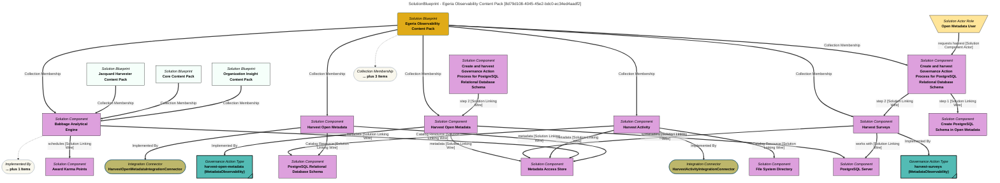

```mermaid
---
title: SolutionBlueprint - Egeria Observability Content Pack [8d79d108-4045-45e2-bdc0-ec34ed4aadf2]
---
flowchart TD
%%{init: {"flowchart": {"htmlLabels": false}} }%%

1@{ shape: rounded, label: "*Solution Blueprint*
**Egeria Observability Content Pack**"}
2@{ shape: rect, label: "*Solution Component*
**Harvest Open Metadata**"}
1==>|"Collection Membership"|2
3@{ shape: rect, label: "*Solution Component*
**Metadata Access Store**"}
2==>|"metadata [Solution Linking Wire]"|3
4@{ shape: rect, label: "*Solution Component*
**PostgreSQL Server**"}
2==>|"works with [Solution Linking Wire]"|4
5@{ shape: rect, label: "*Solution Component*
**Create and harvest Governance Action Process for PostgreSQL Relational Database Schema**"}
5==>|"step 2 [Solution Linking Wire]"|2
6@{ shape: tag-rect, label: "*Governance Action Type*
**harvest-open-metadata (MetadataObservability)**"}
2==>|"Implemented By"|6
7@{ shape: rect, label: "*Solution Component*
**Harvest Surveys**"}
1==>|"Collection Membership"|7
7==>|"metadata [Solution Linking Wire]"|3
7==>|"works with [Solution Linking Wire]"|4
8@{ shape: rect, label: "*Solution Component*
**Create and harvest Governance Action Process for PostgreSQL Relational Database Schema**"}
8==>|"step 2 [Solution Linking Wire]"|7
9@{ shape: tag-rect, label: "*Governance Action Type*
**harvest-surveys (MetadataObservability)**"}
7==>|"Implemented By"|9
10@{ shape: rect, label: "*Solution Component*
**Harvest Activity**"}
1==>|"Collection Membership"|10
10==>|"metadata [Solution Linking Wire]"|3
11@{ shape: rect, label: "*Solution Component*
**PostgreSQL Relational Database Schema**"}
10==>|"Catalog Resource [Solution Linking Wire]"|11
12@{ shape: rect, label: "*Solution Component*
**File System Directory**"}
10==>|"Catalog Resource [Solution Linking Wire]"|12
13@{ shape: stadium, label: "*Integration Connector*
**HarvestActivityIntegrationConnector**"}
10==>|"Implemented By"|13
14@{ shape: rect, label: "*Solution Component*
**Babbage Analytical Engine**"}
1==>|"Collection Membership"|14
15@{ shape: rect, label: "*Solution Component*
**Award Karma Points**"}
14==>|"schedules [Solution Linking Wire]"|15
14==>|"metadata [Solution Linking Wire]"|3
16@{ shape: rect, label: "*Solution Blueprint*
**Jacquard Harvester Content Pack**"}
16==>|"Collection Membership"|14
17@{ shape: rect, label: "*Solution Blueprint*
**Core Content Pack**"}
17==>|"Collection Membership"|14
18@{ shape: rect, label: "*Solution Blueprint*
**Organization Insight Content Pack**"}
18==>|"Collection Membership"|14
19@{ shape: stadium, label: "*Implemented By*
**... plus 1 Items**"}
14-.->19
20@{ shape: rect, label: "*Solution Component*
**Harvest Open Metadata**"}
1==>|"Collection Membership"|20
20==>|"metadata [Solution Linking Wire]"|3
20==>|"Catalog Resource [Solution Linking Wire]"|11
21@{ shape: stadium, label: "*Integration Connector*
**HarvestOpenMetadataIntegrationConnector**"}
20==>|"Implemented By"|21
1==>|"Collection Membership"|8
22@{ shape: trap-t, label: "*Solution Actor Role*
**Open Metadata User**"}
22==>|"requests harvest [Solution Component Actor]"|8
23@{ shape: rect, label: "*Solution Component*
**Create PostgreSQL Schema in Open Metadata**"}
8==>|"step 1 [Solution Linking Wire]"|23
24@{ shape: stadium, label: "*Collection Membership*
**... plus 3 Items**"}
1-.->24
style 11 color:#000000, fill:#dda0dd, stroke:#000000
style 22 color:#000000, fill:#FFE599, stroke:#000000
style 12 color:#000000, fill:#dda0dd, stroke:#000000
style 23 color:#000000, fill:#dda0dd, stroke:#000000
style 13 color:#000000, fill:#bdb76b, stroke:#004563
style 24 color:#000000, fill:#F9F7ED, stroke:#b7c0c7
style 14 color:#000000, fill:#dda0dd, stroke:#000000
style 15 color:#000000, fill:#dda0dd, stroke:#000000
style 16 color:#000000, fill:#f5fffa, stroke:#000000
style 17 color:#000000, fill:#f5fffa, stroke:#000000
style 18 color:#000000, fill:#f5fffa, stroke:#000000
style 19 color:#000000, fill:#F9F7ED, stroke:#b7c0c7
style 1 color:#000000, fill:#e0ab18, stroke:#004563
style 2 color:#000000, fill:#dda0dd, stroke:#000000
style 3 color:#000000, fill:#dda0dd, stroke:#000000
style 4 color:#000000, fill:#dda0dd, stroke:#000000
style 5 color:#000000, fill:#dda0dd, stroke:#000000
style 6 color:#000000, fill:#53bbb4, stroke:#000000
style 7 color:#000000, fill:#dda0dd, stroke:#000000
style 8 color:#000000, fill:#dda0dd, stroke:#000000
style 9 color:#000000, fill:#53bbb4, stroke:#000000
style 20 color:#000000, fill:#dda0dd, stroke:#000000
style 10 color:#000000, fill:#dda0dd, stroke:#000000
style 21 color:#000000, fill:#bdb76b, stroke:#004563
click 11 "https://www.postgresql.org/" "Click for more documentation" _blank
click 12 "https://egeria-project.org/types/2/0220-Files-and-Folders/" "Click for more documentation" _blank
click 23 "https://egeria-project.org/concepts/governance-action-type/" "Click for more documentation" _blank
click 2 "https://egeria-project.org/concepts/governance-action-type/" "Click for more documentation" _blank
click 3 "https://egeria-project.org/concepts/metadata-access-store/" "Click for more documentation" _blank
click 14 "https://egeria-project.org/concepts/integration-connector/" "Click for more documentation" _blank
click 4 "https://www.postgresql.org/" "Click for more documentation" _blank
click 15 "https://egeria-project.org/concepts/governance-action-type/" "Click for more documentation" _blank
click 7 "https://egeria-project.org/concepts/governance-action-type/" "Click for more documentation" _blank
click 20 "https://egeria-project.org/concepts/integration-connector/" "Click for more documentation" _blank
click 10 "https://egeria-project.org/concepts/integration-connector/" "Click for more documentation" _blank
```
