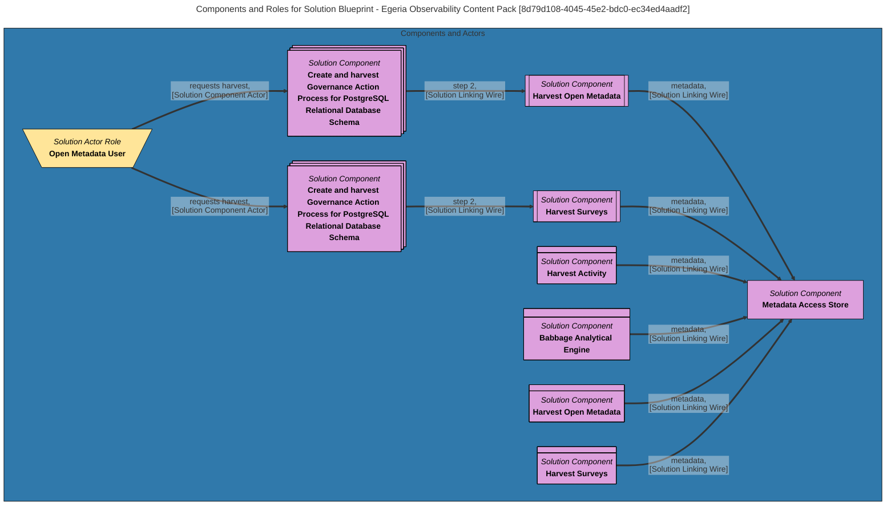

```mermaid
---
title: Components and Roles for Solution Blueprint - Egeria Observability Content Pack [8d79d108-4045-45e2-bdc0-ec34ed4aadf2]
---
flowchart TD
%%{init: {"flowchart": {"htmlLabels": false}} }%%

subgraph 1 [Components and Actors]
2@{ shape: subproc, label: "*Solution Component*
**Harvest Open Metadata**"}
3@{ shape: subproc, label: "*Solution Component*
**Harvest Surveys**"}
4@{ shape: div-rect, label: "*Solution Component*
**Harvest Activity**"}
5@{ shape: div-rect, label: "*Solution Component*
**Babbage Analytical Engine**"}
6@{ shape: div-rect, label: "*Solution Component*
**Harvest Open Metadata**"}
7@{ shape: processes, label: "*Solution Component*
**Create and harvest Governance Action Process for PostgreSQL Relational Database Schema**"}
8@{ shape: div-rect, label: "*Solution Component*
**Harvest Surveys**"}
9@{ shape: rect, label: "*Solution Component*
**Metadata Access Store**"}
10@{ shape: processes, label: "*Solution Component*
**Create and harvest Governance Action Process for PostgreSQL Relational Database Schema**"}
2==>|"metadata,
[Solution Linking Wire]"|9
10==>|"step 2,
[Solution Linking Wire]"|2
3==>|"metadata,
[Solution Linking Wire]"|9
7==>|"step 2,
[Solution Linking Wire]"|3
4==>|"metadata,
[Solution Linking Wire]"|9
5==>|"metadata,
[Solution Linking Wire]"|9
6==>|"metadata,
[Solution Linking Wire]"|9
11@{ shape: trap-t, label: "*Solution Actor Role*
**Open Metadata User**"}
11==>|"requests harvest,
[Solution Component Actor]"|7
8==>|"metadata,
[Solution Linking Wire]"|9
11==>|"requests harvest,
[Solution Component Actor]"|10
end
style 11 color:#000000, fill:#FFE599, stroke:#000000
style 1 color:#FFFFFF, fill:#3079ab, stroke:#000000
style 2 color:#000000, fill:#dda0dd, stroke:#000000
style 3 color:#000000, fill:#dda0dd, stroke:#000000
style 4 color:#000000, fill:#dda0dd, stroke:#000000
style 5 color:#000000, fill:#dda0dd, stroke:#000000
style 6 color:#000000, fill:#dda0dd, stroke:#000000
style 7 color:#000000, fill:#dda0dd, stroke:#000000
style 8 color:#000000, fill:#dda0dd, stroke:#000000
style 9 color:#000000, fill:#dda0dd, stroke:#000000
style 10 color:#000000, fill:#dda0dd, stroke:#000000
click 2 "https://egeria-project.org/concepts/governance-action-type/" "Click for more documentation" _blank
click 3 "https://egeria-project.org/concepts/governance-action-type/" "Click for more documentation" _blank
click 4 "https://egeria-project.org/concepts/integration-connector/" "Click for more documentation" _blank
click 5 "https://egeria-project.org/concepts/integration-connector/" "Click for more documentation" _blank
click 6 "https://egeria-project.org/concepts/integration-connector/" "Click for more documentation" _blank
click 8 "https://egeria-project.org/concepts/integration-connector/" "Click for more documentation" _blank
click 9 "https://egeria-project.org/concepts/metadata-access-store/" "Click for more documentation" _blank
```
