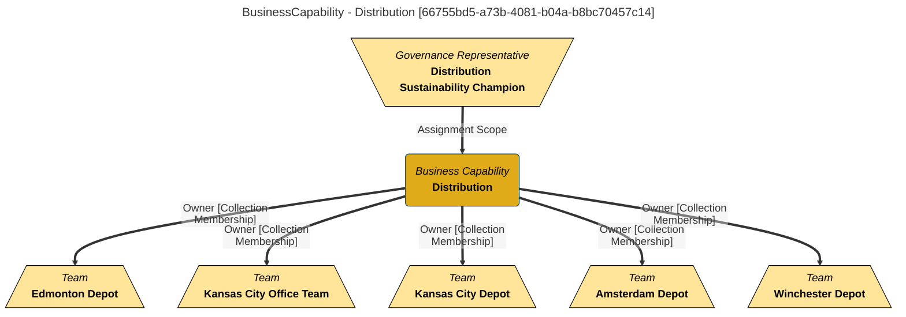

```mermaid
---
title: BusinessCapability - Distribution [66755bd5-a73b-4081-b04a-b8bc70457c14]
---
flowchart TD
%%{init: {"flowchart": {"htmlLabels": false}} }%%

1@{ shape: rounded, label: "*Business Capability*
**Distribution**"}
2@{ shape: trap-b, label: "*Team*
**Edmonton Depot**"}
1==>|"Owner [Collection Membership]"|2
3@{ shape: trap-b, label: "*Team*
**Kansas City Office Team**"}
1==>|"Owner [Collection Membership]"|3
4@{ shape: trap-b, label: "*Team*
**Kansas City Depot**"}
1==>|"Owner [Collection Membership]"|4
5@{ shape: trap-b, label: "*Team*
**Amsterdam Depot**"}
1==>|"Owner [Collection Membership]"|5
6@{ shape: trap-b, label: "*Team*
**Winchester Depot**"}
1==>|"Owner [Collection Membership]"|6
7@{ shape: trap-t, label: "*Governance Representative*
**Distribution Sustainability Champion**"}
7==>|"Assignment Scope"|1
style 1 color:#000000, fill:#e0ab18, stroke:#004563
style 2 color:#000000, fill:#FFE599, stroke:#000000
style 3 color:#000000, fill:#FFE599, stroke:#000000
style 4 color:#000000, fill:#FFE599, stroke:#000000
style 5 color:#000000, fill:#FFE599, stroke:#000000
style 6 color:#000000, fill:#FFE599, stroke:#000000
style 7 color:#000000, fill:#FFE599, stroke:#000000
```
