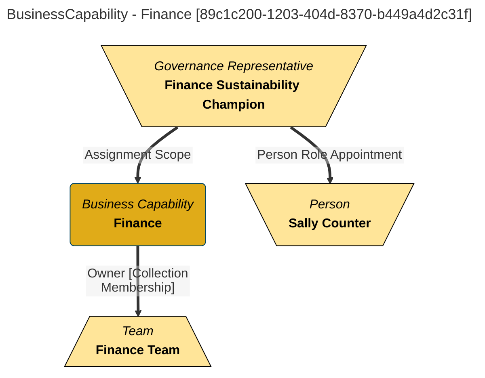

```mermaid
---
title: BusinessCapability - Finance [89c1c200-1203-404d-8370-b449a4d2c31f]
---
flowchart TD
%%{init: {"flowchart": {"htmlLabels": false}} }%%

1@{ shape: rounded, label: "*Business Capability*
**Finance**"}
2@{ shape: trap-b, label: "*Team*
**Finance Team**"}
1==>|"Owner [Collection Membership]"|2
3@{ shape: trap-t, label: "*Governance Representative*
**Finance Sustainability Champion**"}
3==>|"Assignment Scope"|1
4@{ shape: trap-t, label: "*Person*
**Sally Counter**"}
3==>|"Person Role Appointment"|4
style 1 color:#000000, fill:#e0ab18, stroke:#004563
style 2 color:#000000, fill:#FFE599, stroke:#000000
style 3 color:#000000, fill:#FFE599, stroke:#000000
style 4 color:#000000, fill:#FFE599, stroke:#000000
```
