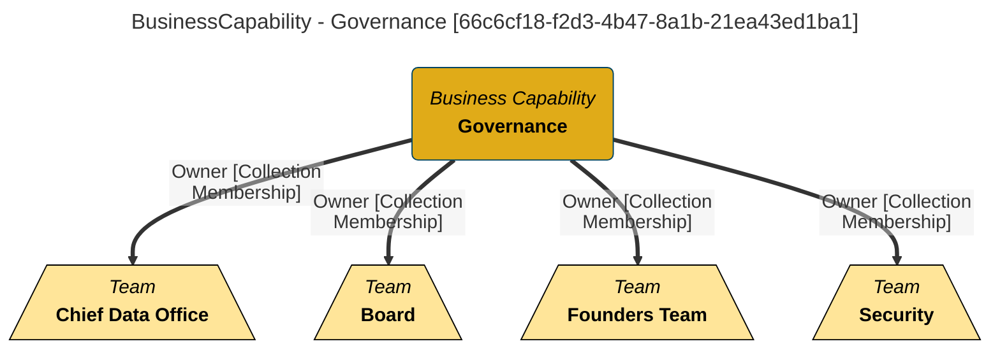

```mermaid
---
title: BusinessCapability - Governance [66c6cf18-f2d3-4b47-8a1b-21ea43ed1ba1]
---
flowchart TD
%%{init: {"flowchart": {"htmlLabels": false}} }%%

1@{ shape: rounded, label: "*Business Capability*
**Governance**"}
2@{ shape: trap-b, label: "*Team*
**Chief Data Office**"}
1==>|"Owner [Collection Membership]"|2
3@{ shape: trap-b, label: "*Team*
**Board**"}
1==>|"Owner [Collection Membership]"|3
4@{ shape: trap-b, label: "*Team*
**Founders Team**"}
1==>|"Owner [Collection Membership]"|4
5@{ shape: trap-b, label: "*Team*
**Security**"}
1==>|"Owner [Collection Membership]"|5
style 1 color:#000000, fill:#e0ab18, stroke:#004563
style 2 color:#000000, fill:#FFE599, stroke:#000000
style 3 color:#000000, fill:#FFE599, stroke:#000000
style 4 color:#000000, fill:#FFE599, stroke:#000000
style 5 color:#000000, fill:#FFE599, stroke:#000000
```
