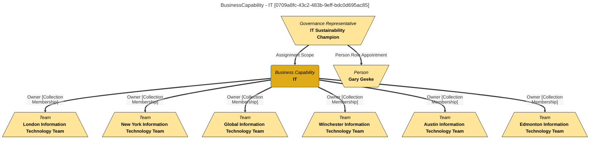

```mermaid
---
title: BusinessCapability - IT [0709a8fc-43c2-483b-9eff-bdc0d695ac85]
---
flowchart TD
%%{init: {"flowchart": {"htmlLabels": false}} }%%

1@{ shape: rounded, label: "*Business Capability*
**IT**"}
2@{ shape: trap-b, label: "*Team*
**London Information Technology Team**"}
1==>|"Owner [Collection Membership]"|2
3@{ shape: trap-b, label: "*Team*
**New York Information Technology Team**"}
1==>|"Owner [Collection Membership]"|3
4@{ shape: trap-b, label: "*Team*
**Global Information Technology Team**"}
1==>|"Owner [Collection Membership]"|4
5@{ shape: trap-b, label: "*Team*
**Winchester Information Technology Team**"}
1==>|"Owner [Collection Membership]"|5
6@{ shape: trap-b, label: "*Team*
**Austin Information Technology Team**"}
1==>|"Owner [Collection Membership]"|6
7@{ shape: trap-b, label: "*Team*
**Edmonton Information Technology Team**"}
1==>|"Owner [Collection Membership]"|7
8@{ shape: trap-t, label: "*Governance Representative*
**IT Sustainability Champion**"}
8==>|"Assignment Scope"|1
9@{ shape: trap-t, label: "*Person*
**Gary Geeke**"}
8==>|"Person Role Appointment"|9
style 1 color:#000000, fill:#e0ab18, stroke:#004563
style 2 color:#000000, fill:#FFE599, stroke:#000000
style 3 color:#000000, fill:#FFE599, stroke:#000000
style 4 color:#000000, fill:#FFE599, stroke:#000000
style 5 color:#000000, fill:#FFE599, stroke:#000000
style 6 color:#000000, fill:#FFE599, stroke:#000000
style 7 color:#000000, fill:#FFE599, stroke:#000000
style 8 color:#000000, fill:#FFE599, stroke:#000000
style 9 color:#000000, fill:#FFE599, stroke:#000000
```
