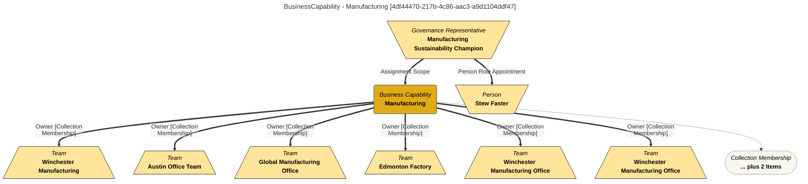

```mermaid
---
title: BusinessCapability - Manufacturing [4df44470-217b-4c86-aac3-a9d1104ddf47]
---
flowchart TD
%%{init: {"flowchart": {"htmlLabels": false}} }%%

1@{ shape: rounded, label: "*Business Capability*
**Manufacturing**"}
2@{ shape: trap-b, label: "*Team*
**Winchester Manufacturing**"}
1==>|"Owner [Collection Membership]"|2
3@{ shape: trap-b, label: "*Team*
**Austin Office Team**"}
1==>|"Owner [Collection Membership]"|3
4@{ shape: trap-b, label: "*Team*
**Global Manufacturing Office**"}
1==>|"Owner [Collection Membership]"|4
5@{ shape: trap-b, label: "*Team*
**Edmonton Factory**"}
1==>|"Owner [Collection Membership]"|5
6@{ shape: trap-b, label: "*Team*
**Winchester Manufacturing Office**"}
1==>|"Owner [Collection Membership]"|6
7@{ shape: trap-b, label: "*Team*
**Winchester Manufacturing Office**"}
1==>|"Owner [Collection Membership]"|7
8@{ shape: stadium, label: "*Collection Membership*
**... plus 2 Items**"}
1-.->8
9@{ shape: trap-t, label: "*Governance Representative*
**Manufacturing Sustainability Champion**"}
9==>|"Assignment Scope"|1
10@{ shape: trap-t, label: "*Person*
**Stew Faster**"}
9==>|"Person Role Appointment"|10
style 1 color:#000000, fill:#e0ab18, stroke:#004563
style 2 color:#000000, fill:#FFE599, stroke:#000000
style 3 color:#000000, fill:#FFE599, stroke:#000000
style 4 color:#000000, fill:#FFE599, stroke:#000000
style 5 color:#000000, fill:#FFE599, stroke:#000000
style 6 color:#000000, fill:#FFE599, stroke:#000000
style 7 color:#000000, fill:#FFE599, stroke:#000000
style 8 color:#000000, fill:#F9F7ED, stroke:#b7c0c7
style 9 color:#000000, fill:#FFE599, stroke:#000000
style 10 color:#000000, fill:#FFE599, stroke:#000000
```
