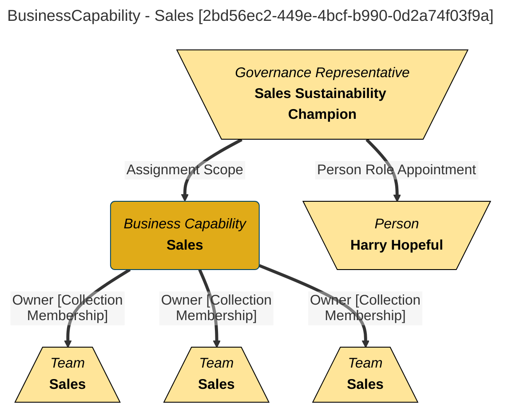

```mermaid
---
title: BusinessCapability - Sales [2bd56ec2-449e-4bcf-b990-0d2a74f03f9a]
---
flowchart TD
%%{init: {"flowchart": {"htmlLabels": false}} }%%

1@{ shape: rounded, label: "*Business Capability*
**Sales**"}
2@{ shape: trap-b, label: "*Team*
**Sales**"}
1==>|"Owner [Collection Membership]"|2
3@{ shape: trap-b, label: "*Team*
**Sales**"}
1==>|"Owner [Collection Membership]"|3
4@{ shape: trap-b, label: "*Team*
**Sales**"}
1==>|"Owner [Collection Membership]"|4
5@{ shape: trap-t, label: "*Governance Representative*
**Sales Sustainability Champion**"}
5==>|"Assignment Scope"|1
6@{ shape: trap-t, label: "*Person*
**Harry Hopeful**"}
5==>|"Person Role Appointment"|6
style 1 color:#000000, fill:#e0ab18, stroke:#004563
style 2 color:#000000, fill:#FFE599, stroke:#000000
style 3 color:#000000, fill:#FFE599, stroke:#000000
style 4 color:#000000, fill:#FFE599, stroke:#000000
style 5 color:#000000, fill:#FFE599, stroke:#000000
style 6 color:#000000, fill:#FFE599, stroke:#000000
```
