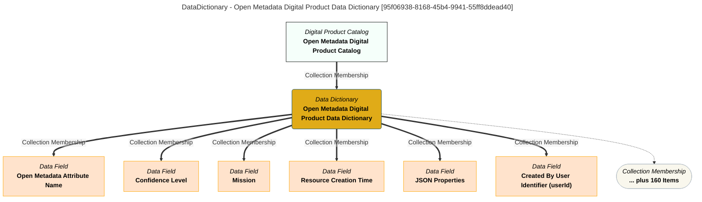

```mermaid
---
title: DataDictionary - Open Metadata Digital Product Data Dictionary [95f06938-8168-45b4-9941-55ff8ddead40]
---
flowchart TD
%%{init: {"flowchart": {"htmlLabels": false}} }%%

1@{ shape: rounded, label: "*Data Dictionary*
**Open Metadata Digital Product Data Dictionary**"}
2@{ shape: rect, label: "*Digital Product Catalog*
**Open Metadata Digital Product Catalog**"}
2==>|"Collection Membership"|1
3@{ shape: rect, label: "*Data Field*
**Open Metadata Attribute Name**"}
1==>|"Collection Membership"|3
4@{ shape: rect, label: "*Data Field*
**Confidence Level**"}
1==>|"Collection Membership"|4
5@{ shape: rect, label: "*Data Field*
**Mission**"}
1==>|"Collection Membership"|5
6@{ shape: rect, label: "*Data Field*
**Resource Creation Time**"}
1==>|"Collection Membership"|6
7@{ shape: rect, label: "*Data Field*
**JSON Properties**"}
1==>|"Collection Membership"|7
8@{ shape: rect, label: "*Data Field*
**Created By User Identifier (userId)**"}
1==>|"Collection Membership"|8
9@{ shape: stadium, label: "*Collection Membership*
**... plus 160 Items**"}
1-.->9
style 1 color:#000000, fill:#e0ab18, stroke:#004563
style 2 color:#000000, fill:#f5fffa, stroke:#000000
style 3 color:#000000, fill:#ffe3cc, stroke:#FFA500
style 4 color:#000000, fill:#ffe3cc, stroke:#FFA500
style 5 color:#000000, fill:#ffe3cc, stroke:#FFA500
style 6 color:#000000, fill:#ffe3cc, stroke:#FFA500
style 7 color:#000000, fill:#ffe3cc, stroke:#FFA500
style 8 color:#000000, fill:#ffe3cc, stroke:#FFA500
style 9 color:#000000, fill:#F9F7ED, stroke:#b7c0c7
```
