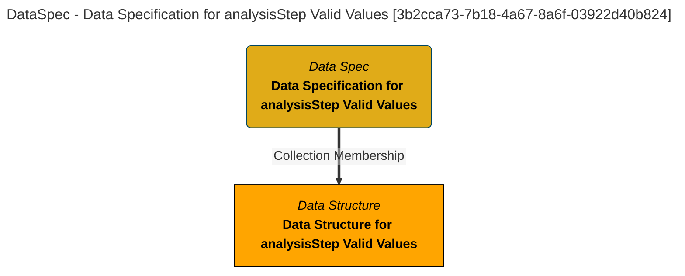

```mermaid
---
title: DataSpec - Data Specification for analysisStep Valid Values [3b2cca73-7b18-4a67-8a6f-03922d40b824]
---
flowchart TD
%%{init: {"flowchart": {"htmlLabels": false}} }%%

1@{ shape: rounded, label: "*Data Spec*
**Data Specification for analysisStep Valid Values**"}
2@{ shape: rect, label: "*Data Structure*
**Data Structure for analysisStep Valid Values**"}
1==>|"Collection Membership"|2
style 1 color:#000000, fill:#e0ab18, stroke:#004563
style 2 color:#000000, fill:#FFA500, stroke:#000000
```
> Data Specification for analysisStep Valid Values: The data specification lists the fields in the Valid Metadata Value Set: analysisStep product. (Extracted from 6.0-SNAPSHOT)
