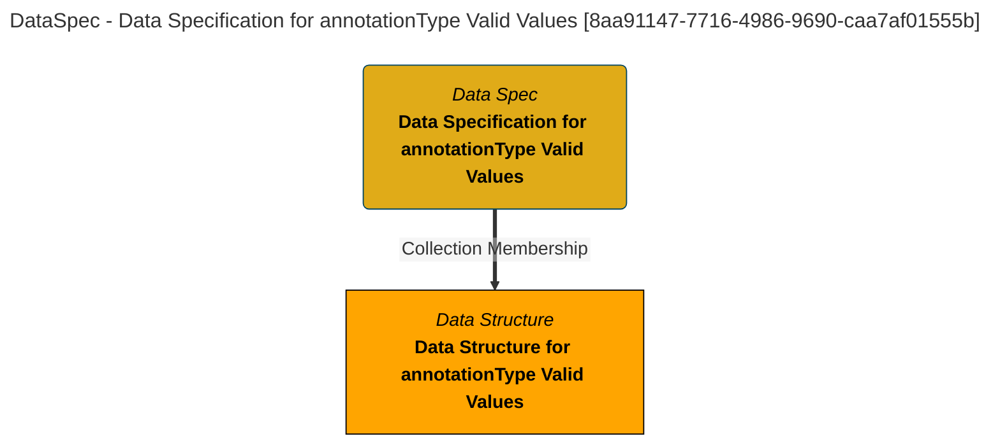

```mermaid
---
title: DataSpec - Data Specification for annotationType Valid Values [8aa91147-7716-4986-9690-caa7af01555b]
---
flowchart TD
%%{init: {"flowchart": {"htmlLabels": false}} }%%

1@{ shape: rounded, label: "*Data Spec*
**Data Specification for annotationType Valid Values**"}
2@{ shape: rect, label: "*Data Structure*
**Data Structure for annotationType Valid Values**"}
1==>|"Collection Membership"|2
style 1 color:#000000, fill:#e0ab18, stroke:#004563
style 2 color:#000000, fill:#FFA500, stroke:#000000
```
> Data Specification for annotationType Valid Values: The data specification lists the fields in the Valid Metadata Value Set: annotationType product. (Extracted from 6.0-SNAPSHOT)
