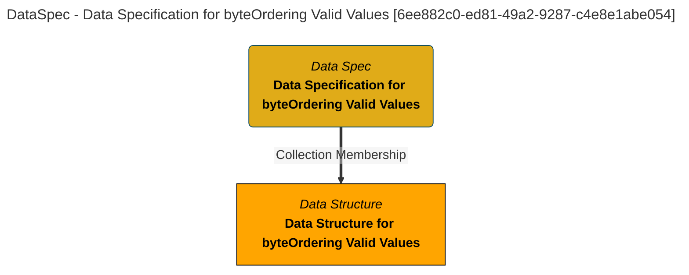

```mermaid
---
title: DataSpec - Data Specification for byteOrdering Valid Values [6ee882c0-ed81-49a2-9287-c4e8e1abe054]
---
flowchart TD
%%{init: {"flowchart": {"htmlLabels": false}} }%%

1@{ shape: rounded, label: "*Data Spec*
**Data Specification for byteOrdering Valid Values**"}
2@{ shape: rect, label: "*Data Structure*
**Data Structure for byteOrdering Valid Values**"}
1==>|"Collection Membership"|2
style 1 color:#000000, fill:#e0ab18, stroke:#004563
style 2 color:#000000, fill:#FFA500, stroke:#000000
```
> Data Specification for byteOrdering Valid Values: The data specification lists the fields in the Valid Metadata Value Set: byteOrdering product. (Extracted from 6.0-SNAPSHOT)
