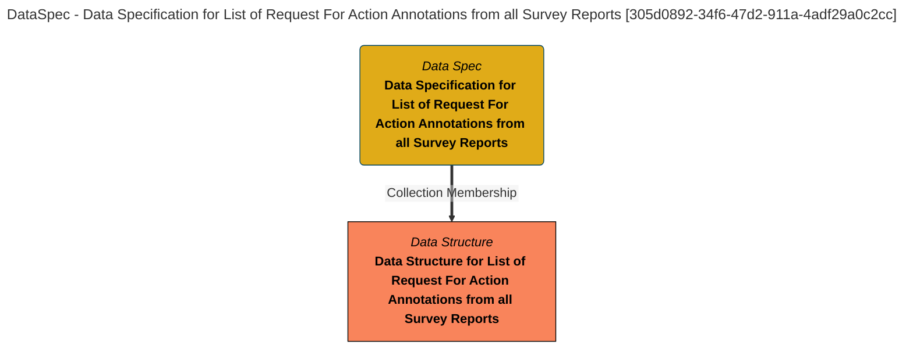

> Data Specification for List of Request For Action Annotations from all Survey Reports: The data specification lists the fields in the Request For Action Target List product. (Extracted from 6.0-SNAPSHOT)
