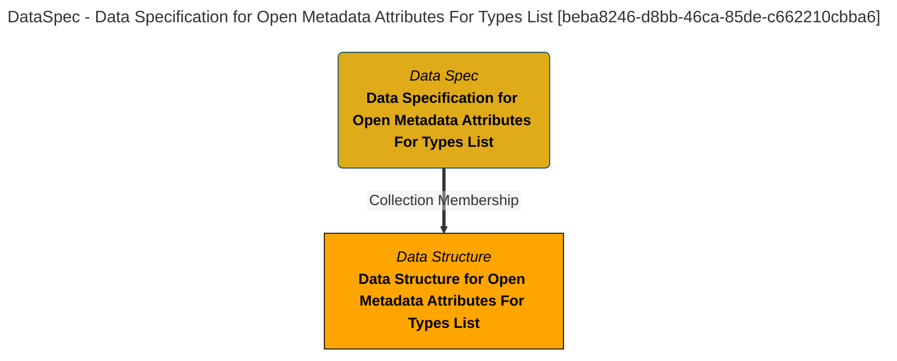

```mermaid
---
title: DataSpec - Data Specification for Open Metadata Attributes For Types List [beba8246-d8bb-46ca-85de-c662210cbba6]
---
flowchart TD
%%{init: {"flowchart": {"htmlLabels": false}} }%%

1@{ shape: rounded, label: "*Data Spec*
**Data Specification for Open Metadata Attributes For Types List**"}
2@{ shape: rect, label: "*Data Structure*
**Data Structure for Open Metadata Attributes For Types List**"}
1==>|"Collection Membership"|2
style 1 color:#000000, fill:#e0ab18, stroke:#004563
style 2 color:#000000, fill:#FFA500, stroke:#000000
```
> Data Specification for Open Metadata Attributes For Types List: The data specification lists the fields in the Open Metadata Attributes For Types List product. (Extracted from 6.0-SNAPSHOT)
