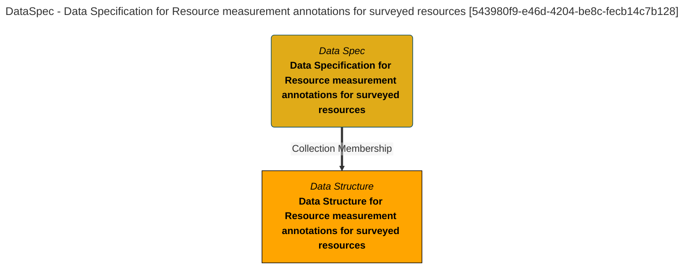

```mermaid
---
title: DataSpec - Data Specification for Resource measurement annotations for surveyed resources [543980f9-e46d-4204-be8c-fecb14c7b128]
---
flowchart TD
%%{init: {"flowchart": {"htmlLabels": false}} }%%

1@{ shape: rounded, label: "*Data Spec*
**Data Specification for Resource measurement annotations for surveyed resources**"}
2@{ shape: rect, label: "*Data Structure*
**Data Structure for Resource measurement annotations for surveyed resources**"}
1==>|"Collection Membership"|2
style 1 color:#000000, fill:#e0ab18, stroke:#004563
style 2 color:#000000, fill:#FFA500, stroke:#000000
```
> Data Specification for Resource measurement annotations for surveyed resources: The data specification lists the fields in the Resource Measurements product. (Extracted from 6.0-SNAPSHOT)
