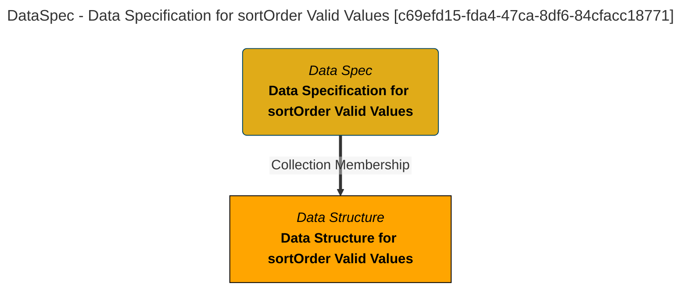

```mermaid
---
title: DataSpec - Data Specification for sortOrder Valid Values [c69efd15-fda4-47ca-8df6-84cfacc18771]
---
flowchart TD
%%{init: {"flowchart": {"htmlLabels": false}} }%%

1@{ shape: rounded, label: "*Data Spec*
**Data Specification for sortOrder Valid Values**"}
2@{ shape: rect, label: "*Data Structure*
**Data Structure for sortOrder Valid Values**"}
1==>|"Collection Membership"|2
style 1 color:#000000, fill:#e0ab18, stroke:#004563
style 2 color:#000000, fill:#FFA500, stroke:#000000
```
> Data Specification for sortOrder Valid Values: The data specification lists the fields in the Valid Metadata Value Set: sortOrder product. (Extracted from 6.0-SNAPSHOT)
