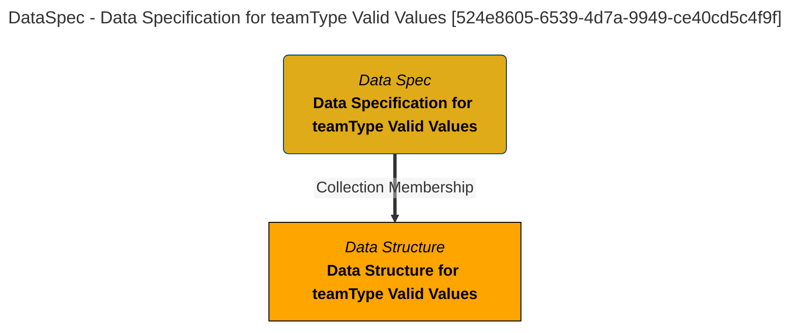

```mermaid
---
title: DataSpec - Data Specification for teamType Valid Values [524e8605-6539-4d7a-9949-ce40cd5c4f9f]
---
flowchart TD
%%{init: {"flowchart": {"htmlLabels": false}} }%%

1@{ shape: rounded, label: "*Data Spec*
**Data Specification for teamType Valid Values**"}
2@{ shape: rect, label: "*Data Structure*
**Data Structure for teamType Valid Values**"}
1==>|"Collection Membership"|2
style 1 color:#000000, fill:#e0ab18, stroke:#004563
style 2 color:#000000, fill:#FFA500, stroke:#000000
```
> Data Specification for teamType Valid Values: The data specification lists the fields in the Valid Metadata Value Set: teamType product. (Extracted from 6.0-SNAPSHOT)
