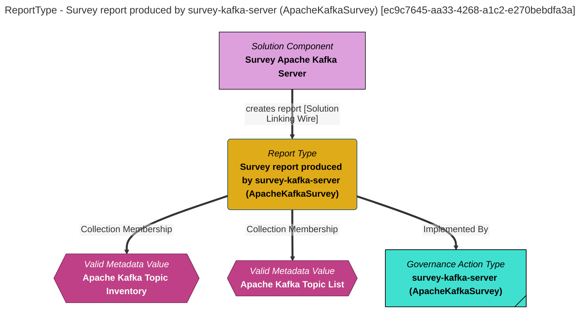

```mermaid
---
title: ReportType - Survey report produced by survey-kafka-server (ApacheKafkaSurvey) [ec9c7645-aa33-4268-a1c2-e270bebdfa3a]
---
flowchart TD
%%{init: {"flowchart": {"htmlLabels": false}} }%%

1@{ shape: rounded, label: "*Report Type*
**Survey report produced by survey-kafka-server (ApacheKafkaSurvey)**"}
2@{ shape: hex, label: "*Valid Metadata Value*
**Apache Kafka Topic Inventory**"}
1==>|"Collection Membership"|2
3@{ shape: hex, label: "*Valid Metadata Value*
**Apache Kafka Topic List**"}
1==>|"Collection Membership"|3
4@{ shape: rect, label: "*Solution Component*
**Survey Apache Kafka Server**"}
4==>|"creates report [Solution Linking Wire]"|1
5@{ shape: tag-rect, label: "*Governance Action Type*
**survey-kafka-server (ApacheKafkaSurvey)**"}
1==>|"Implemented By"|5
style 1 color:#000000, fill:#e0ab18, stroke:#004563
style 2 color:#FFFFFF, fill:#bf4086, stroke:#732650
style 3 color:#FFFFFF, fill:#bf4086, stroke:#732650
style 4 color:#000000, fill:#DDA0DD, stroke:#000000
style 5 color:#000000, fill:#40E0D0, stroke:#000000
click 4 "https://egeria-project.org/concepts/governance-action-type/" "Click for more documentation" _blank
```
> Survey report produced by survey-kafka-server (ApacheKafkaSurvey): Discovers the topics supported by the Apache Kafka Server. (Extracted from 6.0-SNAPSHOT)
