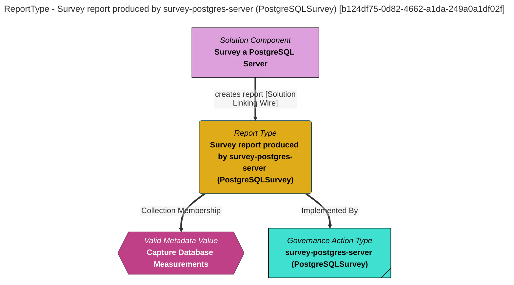

```mermaid
---
title: ReportType - Survey report produced by survey-postgres-server (PostgreSQLSurvey) [b124df75-0d82-4662-a1da-249a0a1df02f]
---
flowchart TD
%%{init: {"flowchart": {"htmlLabels": false}} }%%

1@{ shape: rounded, label: "*Report Type*
**Survey report produced by survey-postgres-server (PostgreSQLSurvey)**"}
2@{ shape: hex, label: "*Valid Metadata Value*
**Capture Database Measurements**"}
1==>|"Collection Membership"|2
3@{ shape: rect, label: "*Solution Component*
**Survey a PostgreSQL Server**"}
3==>|"creates report [Solution Linking Wire]"|1
4@{ shape: tag-rect, label: "*Governance Action Type*
**survey-postgres-server (PostgreSQLSurvey)**"}
1==>|"Implemented By"|4
style 1 color:#000000, fill:#e0ab18, stroke:#004563
style 2 color:#FFFFFF, fill:#bf4086, stroke:#732650
style 3 color:#000000, fill:#DDA0DD, stroke:#000000
style 4 color:#000000, fill:#40E0D0, stroke:#000000
click 3 "https://egeria-project.org/concepts/governance-action-type/" "Click for more documentation" _blank
```
> Survey report produced by survey-postgres-server (PostgreSQLSurvey): Surveys the databases, their tables and columns, found in a PostgreSQL database server (Extracted from 6.0-SNAPSHOT)
