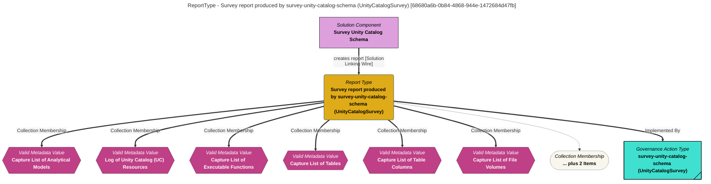

```mermaid
---
title: ReportType - Survey report produced by survey-unity-catalog-schema (UnityCatalogSurvey) [68680a6b-0b84-4868-944e-1472684d47fb]
---
flowchart TD
%%{init: {"flowchart": {"htmlLabels": false}} }%%

1@{ shape: rounded, label: "*Report Type*
**Survey report produced by survey-unity-catalog-schema (UnityCatalogSurvey)**"}
2@{ shape: hex, label: "*Valid Metadata Value*
**Capture List of Analytical Models**"}
1==>|"Collection Membership"|2
3@{ shape: hex, label: "*Valid Metadata Value*
**Log of Unity Catalog (UC) Resources**"}
1==>|"Collection Membership"|3
4@{ shape: hex, label: "*Valid Metadata Value*
**Capture List of Executable Functions**"}
1==>|"Collection Membership"|4
5@{ shape: hex, label: "*Valid Metadata Value*
**Capture List of Tables**"}
1==>|"Collection Membership"|5
6@{ shape: hex, label: "*Valid Metadata Value*
**Capture List of Table Columns**"}
1==>|"Collection Membership"|6
7@{ shape: hex, label: "*Valid Metadata Value*
**Capture List of File Volumes**"}
1==>|"Collection Membership"|7
8@{ shape: stadium, label: "*Collection Membership*
**... plus 2 Items**"}
1-.->8
9@{ shape: rect, label: "*Solution Component*
**Survey Unity Catalog Schema**"}
9==>|"creates report [Solution Linking Wire]"|1
10@{ shape: tag-rect, label: "*Governance Action Type*
**survey-unity-catalog-schema (UnityCatalogSurvey)**"}
1==>|"Implemented By"|10
style 1 color:#000000, fill:#e0ab18, stroke:#004563
style 2 color:#FFFFFF, fill:#bf4086, stroke:#732650
style 3 color:#FFFFFF, fill:#bf4086, stroke:#732650
style 4 color:#FFFFFF, fill:#bf4086, stroke:#732650
style 5 color:#FFFFFF, fill:#bf4086, stroke:#732650
style 6 color:#FFFFFF, fill:#bf4086, stroke:#732650
style 7 color:#FFFFFF, fill:#bf4086, stroke:#732650
style 8 color:#000000, fill:#F9F7ED, stroke:#b7c0c7
style 9 color:#000000, fill:#DDA0DD, stroke:#000000
style 10 color:#000000, fill:#40E0D0, stroke:#000000
click 9 "https://egeria-project.org/concepts/governance-action-type/" "Click for more documentation" _blank
```
> Survey report produced by survey-unity-catalog-schema (UnityCatalogSurvey): Surveys the contents of a schema found in a Unity Catalog Server. (Extracted from 6.0-SNAPSHOT)
