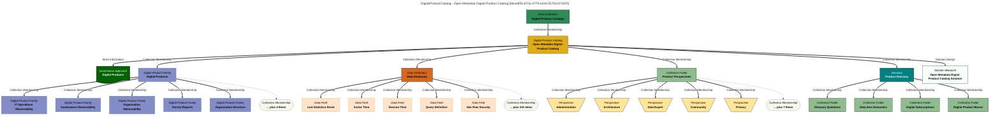

```mermaid
---
title: DigitalProductCatalog - Open Metadata Digital Product Catalog [06cedf56-672a-4779-a34d-357b2227ef25]
---
flowchart TD
%%{init: {"flowchart": {"htmlLabels": false}} }%%

1@{ shape: rounded, label: "*Digital Product Catalog*
**Open Metadata Digital Product Catalog**"}
2@{ shape: doc, label: "*Governance Approach*
**Digital Products**"}
1==>|"More Information"|2
3@{ shape: rect, label: "*Root Collection*
**Digital Product Catalogs**"}
3==>|"Collection Membership"|1
4@{ shape: rect, label: "*Digital Product Family*
**Digital Products**"}
1==>|"Collection Membership"|4
5@{ shape: rect, label: "*Digital Product Family*
**IT Operations Observability**"}
4==>|"Collection Membership"|5
6@{ shape: rect, label: "*Digital Product Family*
**Governance Observability**"}
4==>|"Collection Membership"|6
7@{ shape: rect, label: "*Digital Product Family*
**Organization Observability**"}
4==>|"Collection Membership"|7
8@{ shape: rect, label: "*Digital Product Family*
**Survey Reports**"}
4==>|"Collection Membership"|8
9@{ shape: rect, label: "*Digital Product Family*
**Organization Structure**"}
4==>|"Collection Membership"|9
10@{ shape: stadium, label: "*Collection Membership*
**... plus 4 Items**"}
4-.->10
11@{ shape: rect, label: "*Data Dictionary*
**Data Dictionary**"}
1==>|"Collection Membership"|11
12@{ shape: rect, label: "*Data Field*
**Last Statistics Reset**"}
11==>|"Collection Membership"|12
13@{ shape: rect, label: "*Data Field*
**Active Time**"}
11==>|"Collection Membership"|13
14@{ shape: rect, label: "*Data Field*
**Session Time**"}
11==>|"Collection Membership"|14
15@{ shape: rect, label: "*Data Field*
**Query Definition**"}
11==>|"Collection Membership"|15
16@{ shape: rect, label: "*Data Field*
**Has Row Security**"}
11==>|"Collection Membership"|16
17@{ shape: stadium, label: "*Collection Membership*
**... plus 231 Items**"}
11-.->17
18@{ shape: rect, label: "*Collection Folder*
**Product Perspectives**"}
1==>|"Collection Membership"|18
19@{ shape: trap-t, label: "*Perspective*
**Administration**"}
18==>|"Collection Membership"|19
20@{ shape: trap-t, label: "*Perspective*
**Architecture**"}
18==>|"Collection Membership"|20
21@{ shape: trap-t, label: "*Perspective*
**Data Expert**"}
18==>|"Collection Membership"|21
22@{ shape: trap-t, label: "*Perspective*
**Community**"}
18==>|"Collection Membership"|22
23@{ shape: trap-t, label: "*Perspective*
**Privacy**"}
18==>|"Collection Membership"|23
24@{ shape: stadium, label: "*Collection Membership*
**... plus 7 Items**"}
18-.->24
25@{ shape: rect, label: "*Glossary*
**Product Glossary**"}
1==>|"Collection Membership"|25
26@{ shape: rect, label: "*Collection Folder*
**Glossary Questions**"}
25==>|"Collection Membership"|26
27@{ shape: rect, label: "*Collection Folder*
**Data Item Semantics**"}
25==>|"Collection Membership"|27
28@{ shape: rect, label: "*Collection Folder*
**Digital Subscriptions**"}
25==>|"Collection Membership"|28
29@{ shape: rect, label: "*Collection Folder*
**Digital Product Basics**"}
25==>|"Collection Membership"|29
30@{ shape: rect, label: "*Solution Blueprint*
**Open Metadata Digital Product Catalog Solution**"}
1==>|"Solution Design"|30
style 22 color:#000000, fill:#FFE599, stroke:#000000
style 23 color:#000000, fill:#FFE599, stroke:#000000
style 24 color:#000000, fill:#F9F7ED, stroke:#b7c0c7
style 25 color:#FFFFFF, fill:#008080, stroke:#000000
style 26 color:#000000, fill:#8fbc8f, stroke:#000000
style 27 color:#000000, fill:#8fbc8f, stroke:#000000
style 28 color:#000000, fill:#8fbc8f, stroke:#000000
style 29 color:#000000, fill:#8fbc8f, stroke:#000000
style 30 color:#000000, fill:#f5fffa, stroke:#000000
style 10 color:#000000, fill:#F9F7ED, stroke:#b7c0c7
style 11 color:#000000, fill:#d2691e, stroke:#000000
style 12 color:#000000, fill:#ffe3cc, stroke:#FFA500
style 13 color:#000000, fill:#ffe3cc, stroke:#FFA500
style 14 color:#000000, fill:#ffe3cc, stroke:#FFA500
style 15 color:#000000, fill:#ffe3cc, stroke:#FFA500
style 16 color:#000000, fill:#ffe3cc, stroke:#FFA500
style 17 color:#000000, fill:#F9F7ED, stroke:#b7c0c7
style 18 color:#000000, fill:#8fbc8f, stroke:#000000
style 19 color:#000000, fill:#FFE599, stroke:#000000
style 1 color:#000000, fill:#e0ab18, stroke:#004563
style 2 color:#FFFFFF, fill:#006400, stroke:#000000
style 3 color:#000000, fill:#2e8b57, stroke:#000000
style 4 color:#000000, fill:#838cc7, stroke:#3079ab
style 5 color:#000000, fill:#838cc7, stroke:#3079ab
style 6 color:#000000, fill:#838cc7, stroke:#3079ab
style 7 color:#000000, fill:#838cc7, stroke:#3079ab
style 8 color:#000000, fill:#838cc7, stroke:#3079ab
style 9 color:#000000, fill:#838cc7, stroke:#3079ab
style 20 color:#000000, fill:#FFE599, stroke:#000000
style 21 color:#000000, fill:#FFE599, stroke:#000000
click 22 "https://egeria-project.org/practices/coco-pharmaceuticals/personas/tom-tally/" "Click for more documentation" _blank
click 23 "https://egeria-project.org/practices/coco-pharmaceuticals/personas/faith-broker/" "Click for more documentation" _blank
click 19 "https://egeria-project.org/practices/coco-pharmaceuticals/personas/gary-geeke/" "Click for more documentation" _blank
click 20 "https://egeria-project.org/practices/coco-pharmaceuticals/personas/erin-overview/" "Click for more documentation" _blank
click 21 "https://egeria-project.org/practices/coco-pharmaceuticals/personas/peter-profile/" "Click for more documentation" _blank

```
