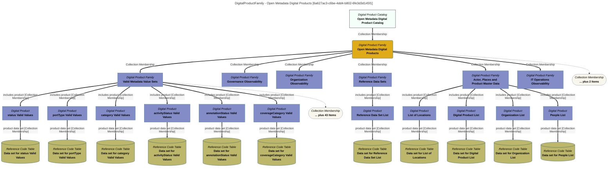

```mermaid
---
title: DigitalProductFamily - Open Metadata Digital Products [6a627ac3-c6be-4dd4-b802-6fe3d3d145f1]
---
flowchart TD
%%{init: {"flowchart": {"htmlLabels": false}} }%%

1@{ shape: rounded, label: "*Digital Product Family*
**Open Metadata Digital Products**"}
2@{ shape: rect, label: "*Digital Product Catalog*
**Open Metadata Digital Product Catalog**"}
2==>|"Collection Membership"|1
3@{ shape: rect, label: "*Digital Product Family*
**Valid Metadata Value Sets**"}
1==>|"Collection Membership"|3
4@{ shape: rect, label: "*Digital Product*
**status Valid Values**"}
3==>|"includes product [Collection Membership]"|4
5@{ shape: cyl, label: "*Reference Code Table*
**Data set for status Valid Values**"}
4==>|"product data set [Collection Membership]"|5
6@{ shape: rect, label: "*Digital Product*
**portType Valid Values**"}
3==>|"includes product [Collection Membership]"|6
7@{ shape: cyl, label: "*Reference Code Table*
**Data set for portType Valid Values**"}
6==>|"product data set [Collection Membership]"|7
8@{ shape: rect, label: "*Digital Product*
**category Valid Values**"}
3==>|"includes product [Collection Membership]"|8
9@{ shape: cyl, label: "*Reference Code Table*
**Data set for category Valid Values**"}
8==>|"product data set [Collection Membership]"|9
10@{ shape: rect, label: "*Digital Product*
**activityStatus Valid Values**"}
3==>|"includes product [Collection Membership]"|10
11@{ shape: cyl, label: "*Reference Code Table*
**Data set for activityStatus Valid Values**"}
10==>|"product data set [Collection Membership]"|11
12@{ shape: rect, label: "*Digital Product*
**annotationStatus Valid Values**"}
3==>|"includes product [Collection Membership]"|12
13@{ shape: cyl, label: "*Reference Code Table*
**Data set for annotationStatus Valid Values**"}
12==>|"product data set [Collection Membership]"|13
14@{ shape: rect, label: "*Digital Product*
**coverageCategory Valid Values**"}
3==>|"includes product [Collection Membership]"|14
15@{ shape: cyl, label: "*Reference Code Table*
**Data set for coverageCategory Valid Values**"}
14==>|"product data set [Collection Membership]"|15
16@{ shape: stadium, label: "*Collection Membership*
**... plus 43 Items**"}
3-.->16
17@{ shape: rect, label: "*Digital Product Family*
**Governance Observability**"}
1==>|"Collection Membership"|17
18@{ shape: rect, label: "*Digital Product Family*
**Organization Observability**"}
1==>|"Collection Membership"|18
19@{ shape: rect, label: "*Digital Product Family*
**Reference Data Sets**"}
1==>|"Collection Membership"|19
20@{ shape: rect, label: "*Digital Product*
**Reference Data Set List**"}
19==>|"includes product [Collection Membership]"|20
21@{ shape: cyl, label: "*Reference Code Table*
**Data set for Reference Data Set List**"}
20==>|"product data set [Collection Membership]"|21
22@{ shape: rect, label: "*Digital Product Family*
**Actor, Places and Product Master Data**"}
1==>|"Collection Membership"|22
23@{ shape: rect, label: "*Digital Product*
**List of Locations**"}
22==>|"includes product [Collection Membership]"|23
24@{ shape: cyl, label: "*Reference Code Table*
**Data set for List of Locations**"}
23==>|"product data set [Collection Membership]"|24
25@{ shape: rect, label: "*Digital Product*
**Digital Product List**"}
22==>|"includes product [Collection Membership]"|25
26@{ shape: cyl, label: "*Reference Code Table*
**Data set for Digital Product List**"}
25==>|"product data set [Collection Membership]"|26
27@{ shape: rect, label: "*Digital Product*
**Organization List**"}
22==>|"includes product [Collection Membership]"|27
28@{ shape: cyl, label: "*Reference Code Table*
**Data set for Organization List**"}
27==>|"product data set [Collection Membership]"|28
29@{ shape: rect, label: "*Digital Product*
**People List**"}
22==>|"includes product [Collection Membership]"|29
30@{ shape: cyl, label: "*Reference Code Table*
**Data set for People List**"}
29==>|"product data set [Collection Membership]"|30
31@{ shape: rect, label: "*Digital Product Family*
**IT Operations Observability**"}
1==>|"Collection Membership"|31
32@{ shape: stadium, label: "*Collection Membership*
**... plus 2 Items**"}
1-.->32
style 22 color:#000000, fill:#838cc7, stroke:#3079ab
style 23 color:#000000, fill:#838cc7, stroke:#3079ab
style 24 color:#000000, fill:#bdb76b, stroke:#004563
style 25 color:#000000, fill:#838cc7, stroke:#3079ab
style 26 color:#000000, fill:#bdb76b, stroke:#004563
style 27 color:#000000, fill:#838cc7, stroke:#3079ab
style 28 color:#000000, fill:#bdb76b, stroke:#004563
style 29 color:#000000, fill:#838cc7, stroke:#3079ab
style 30 color:#000000, fill:#bdb76b, stroke:#004563
style 31 color:#000000, fill:#838cc7, stroke:#3079ab
style 10 color:#000000, fill:#838cc7, stroke:#3079ab
style 32 color:#000000, fill:#F9F7ED, stroke:#b7c0c7
style 11 color:#000000, fill:#bdb76b, stroke:#004563
style 12 color:#000000, fill:#838cc7, stroke:#3079ab
style 13 color:#000000, fill:#bdb76b, stroke:#004563
style 14 color:#000000, fill:#838cc7, stroke:#3079ab
style 15 color:#000000, fill:#bdb76b, stroke:#004563
style 16 color:#000000, fill:#F9F7ED, stroke:#b7c0c7
style 17 color:#000000, fill:#838cc7, stroke:#3079ab
style 18 color:#000000, fill:#838cc7, stroke:#3079ab
style 19 color:#000000, fill:#838cc7, stroke:#3079ab
style 1 color:#000000, fill:#e0ab18, stroke:#004563
style 2 color:#000000, fill:#f5fffa, stroke:#000000
style 3 color:#000000, fill:#838cc7, stroke:#3079ab
style 4 color:#000000, fill:#838cc7, stroke:#3079ab
style 5 color:#000000, fill:#bdb76b, stroke:#004563
style 6 color:#000000, fill:#838cc7, stroke:#3079ab
style 7 color:#000000, fill:#bdb76b, stroke:#004563
style 8 color:#000000, fill:#838cc7, stroke:#3079ab
style 9 color:#000000, fill:#bdb76b, stroke:#004563
style 20 color:#000000, fill:#838cc7, stroke:#3079ab
style 21 color:#000000, fill:#bdb76b, stroke:#004563
```
