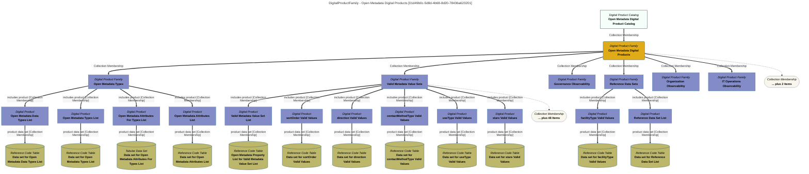

```mermaid
---
title: DigitalProductFamily - Open Metadata Digital Products [01d49b0c-5d8d-4b68-8d20-78436a623201]
---
flowchart TD
%%{init: {"flowchart": {"htmlLabels": false}} }%%

1@{ shape: rounded, label: "*Digital Product Family*
**Open Metadata Digital Products**"}
2@{ shape: rect, label: "*Digital Product Catalog*
**Open Metadata Digital Product Catalog**"}
2==>|"Collection Membership"|1
3@{ shape: rect, label: "*Digital Product Family*
**Open Metadata Types**"}
1==>|"Collection Membership"|3
4@{ shape: rect, label: "*Digital Product*
**Open Metadata Data Types List**"}
3==>|"includes product [Collection Membership]"|4
5@{ shape: cyl, label: "*Reference Code Table*
**Data set for Open Metadata Data Types List**"}
4==>|"product data set [Collection Membership]"|5
6@{ shape: rect, label: "*Digital Product*
**Open Metadata Types List**"}
3==>|"includes product [Collection Membership]"|6
7@{ shape: cyl, label: "*Reference Code Table*
**Data set for Open Metadata Types List**"}
6==>|"product data set [Collection Membership]"|7
8@{ shape: rect, label: "*Digital Product*
**Open Metadata Attributes For Types List**"}
3==>|"includes product [Collection Membership]"|8
9@{ shape: cyl, label: "*Tabular Data Set*
**Data set for Open Metadata Attributes For Types List**"}
8==>|"product data set [Collection Membership]"|9
10@{ shape: rect, label: "*Digital Product*
**Open Metadata Attributes List**"}
3==>|"includes product [Collection Membership]"|10
11@{ shape: cyl, label: "*Reference Code Table*
**Data set for Open Metadata Attributes List**"}
10==>|"product data set [Collection Membership]"|11
12@{ shape: rect, label: "*Digital Product Family*
**Valid Metadata Value Sets**"}
1==>|"Collection Membership"|12
13@{ shape: rect, label: "*Digital Product*
**Valid Metadata Value Set List**"}
12==>|"includes product [Collection Membership]"|13
14@{ shape: cyl, label: "*Reference Code Table*
**Open Metadata Property List for Valid Metadata Value Set List**"}
13==>|"product data set [Collection Membership]"|14
15@{ shape: rect, label: "*Digital Product*
**sortOrder Valid Values**"}
12==>|"includes product [Collection Membership]"|15
16@{ shape: cyl, label: "*Reference Code Table*
**Data set for sortOrder Valid Values**"}
15==>|"product data set [Collection Membership]"|16
17@{ shape: rect, label: "*Digital Product*
**direction Valid Values**"}
12==>|"includes product [Collection Membership]"|17
18@{ shape: cyl, label: "*Reference Code Table*
**Data set for direction Valid Values**"}
17==>|"product data set [Collection Membership]"|18
19@{ shape: rect, label: "*Digital Product*
**contactMethodType Valid Values**"}
12==>|"includes product [Collection Membership]"|19
20@{ shape: cyl, label: "*Reference Code Table*
**Data set for contactMethodType Valid Values**"}
19==>|"product data set [Collection Membership]"|20
21@{ shape: rect, label: "*Digital Product*
**useType Valid Values**"}
12==>|"includes product [Collection Membership]"|21
22@{ shape: cyl, label: "*Reference Code Table*
**Data set for useType Valid Values**"}
21==>|"product data set [Collection Membership]"|22
23@{ shape: rect, label: "*Digital Product*
**stars Valid Values**"}
12==>|"includes product [Collection Membership]"|23
24@{ shape: cyl, label: "*Reference Code Table*
**Data set for stars Valid Values**"}
23==>|"product data set [Collection Membership]"|24
25@{ shape: stadium, label: "*Collection Membership*
**... plus 48 Items**"}
12-.->25
26@{ shape: rect, label: "*Digital Product Family*
**Governance Observability**"}
1==>|"Collection Membership"|26
27@{ shape: rect, label: "*Digital Product Family*
**Reference Data Sets**"}
1==>|"Collection Membership"|27
28@{ shape: rect, label: "*Digital Product*
**facilityType Valid Values**"}
27==>|"includes product [Collection Membership]"|28
29@{ shape: cyl, label: "*Reference Code Table*
**Data set for facilityType Valid Values**"}
28==>|"product data set [Collection Membership]"|29
30@{ shape: rect, label: "*Digital Product*
**Reference Data Set List**"}
27==>|"includes product [Collection Membership]"|30
31@{ shape: cyl, label: "*Reference Code Table*
**Data set for Reference Data Set List**"}
30==>|"product data set [Collection Membership]"|31
32@{ shape: rect, label: "*Digital Product Family*
**Organization Observability**"}
1==>|"Collection Membership"|32
33@{ shape: rect, label: "*Digital Product Family*
**IT Operations Observability**"}
1==>|"Collection Membership"|33
34@{ shape: stadium, label: "*Collection Membership*
**... plus 2 Items**"}
1-.->34
style 22 color:#000000, fill:#BDB76B, stroke:#004563
style 23 color:#000000, fill:#838cc7, stroke:#3079ab
style 24 color:#000000, fill:#BDB76B, stroke:#004563
style 25 color:#000000, fill:#F9F7ED, stroke:#b7c0c7
style 26 color:#000000, fill:#838cc7, stroke:#3079ab
style 27 color:#000000, fill:#838cc7, stroke:#3079ab
style 28 color:#000000, fill:#838cc7, stroke:#3079ab
style 29 color:#000000, fill:#BDB76B, stroke:#004563
style 30 color:#000000, fill:#838cc7, stroke:#3079ab
style 31 color:#000000, fill:#BDB76B, stroke:#004563
style 10 color:#000000, fill:#838cc7, stroke:#3079ab
style 32 color:#000000, fill:#838cc7, stroke:#3079ab
style 11 color:#000000, fill:#BDB76B, stroke:#004563
style 33 color:#000000, fill:#838cc7, stroke:#3079ab
style 12 color:#000000, fill:#838cc7, stroke:#3079ab
style 34 color:#000000, fill:#F9F7ED, stroke:#b7c0c7
style 13 color:#000000, fill:#838cc7, stroke:#3079ab
style 14 color:#000000, fill:#BDB76B, stroke:#004563
style 15 color:#000000, fill:#838cc7, stroke:#3079ab
style 16 color:#000000, fill:#BDB76B, stroke:#004563
style 17 color:#000000, fill:#838cc7, stroke:#3079ab
style 18 color:#000000, fill:#BDB76B, stroke:#004563
style 19 color:#000000, fill:#838cc7, stroke:#3079ab
style 1 color:#000000, fill:#e0ab18, stroke:#004563
style 2 color:#000000, fill:#f5fffa, stroke:#000000
style 3 color:#000000, fill:#838cc7, stroke:#3079ab
style 4 color:#000000, fill:#838cc7, stroke:#3079ab
style 5 color:#000000, fill:#BDB76B, stroke:#004563
style 6 color:#000000, fill:#838cc7, stroke:#3079ab
style 7 color:#000000, fill:#BDB76B, stroke:#004563
style 8 color:#000000, fill:#838cc7, stroke:#3079ab
style 9 color:#000000, fill:#BDB76B, stroke:#004563
style 20 color:#000000, fill:#BDB76B, stroke:#004563
style 21 color:#000000, fill:#838cc7, stroke:#3079ab
```
