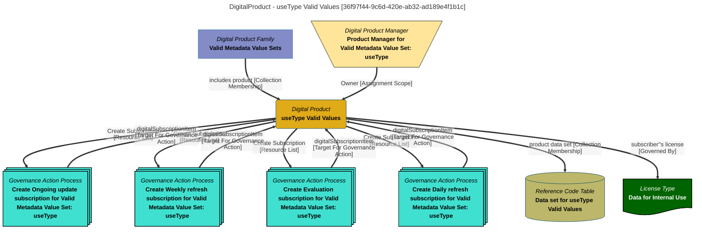

```mermaid
---
title: DigitalProduct - useType Valid Values [36f97f44-9c6d-420e-ab32-ad189e4f1b1c]
---
flowchart TD
%%{init: {"flowchart": {"htmlLabels": false}} }%%

1@{ shape: rounded, label: "*Digital Product*
**useType Valid Values**"}
2@{ shape: processes, label: "*Governance Action Process*
**Create Ongoing update subscription for Valid Metadata Value Set: useType**"}
1==>|"Create Subscription [Resource List]"|2
3@{ shape: processes, label: "*Governance Action Process*
**Create Weekly refresh subscription for Valid Metadata Value Set: useType**"}
1==>|"Create Subscription [Resource List]"|3
4@{ shape: processes, label: "*Governance Action Process*
**Create Evaluation subscription for Valid Metadata Value Set: useType**"}
1==>|"Create Subscription [Resource List]"|4
5@{ shape: processes, label: "*Governance Action Process*
**Create Daily refresh subscription for Valid Metadata Value Set: useType**"}
1==>|"Create Subscription [Resource List]"|5
6@{ shape: rect, label: "*Digital Product Family*
**Valid Metadata Value Sets**"}
6==>|"includes product [Collection Membership]"|1
7@{ shape: cyl, label: "*Reference Code Table*
**Data set for useType Valid Values**"}
1==>|"product data set [Collection Membership]"|7
8@{ shape: trap-t, label: "*Digital Product Manager*
**Product Manager for Valid Metadata Value Set: useType**"}
8==>|"Owner [Assignment Scope]"|1
9@{ shape: doc, label: "*License Type*
**Data for Internal Use**"}
1==>|"subscriber''s license [Governed By]"|9
5==>|"digitalSubscriptionItem [Target For Governance Action]"|1
2==>|"digitalSubscriptionItem [Target For Governance Action]"|1
3==>|"digitalSubscriptionItem [Target For Governance Action]"|1
4==>|"digitalSubscriptionItem [Target For Governance Action]"|1
style 1 color:#000000, fill:#e0ab18, stroke:#004563
style 2 color:#000000, fill:#40E0D0, stroke:#000000
style 3 color:#000000, fill:#40E0D0, stroke:#000000
style 4 color:#000000, fill:#40E0D0, stroke:#000000
style 5 color:#000000, fill:#40E0D0, stroke:#000000
style 6 color:#000000, fill:#838cc7, stroke:#3079ab
style 7 color:#000000, fill:#BDB76B, stroke:#004563
style 8 color:#000000, fill:#FFE599, stroke:#000000
style 9 color:#FFFFFF, fill:#006400, stroke:#000000
```
> useType Valid Values: Describes how the software capability uses the asset. (Extracted from 6.0-SNAPSHOT)
