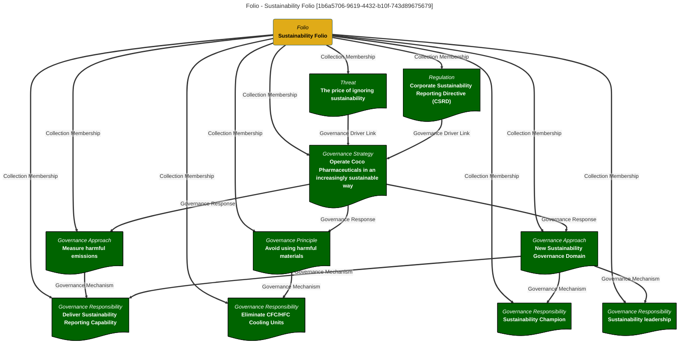

```mermaid
---
title: Folio - Sustainability Folio [1b6a5706-9619-4432-b10f-743d89675679]
---
flowchart TD
%%{init: {"flowchart": {"htmlLabels": false}} }%%

1@{ shape: rounded, label: "*Folio*
**Sustainability Folio**"}
2@{ shape: doc, label: "*Governance Approach*
**Measure harmful emissions**"}
1==>|"Collection Membership"|2
3@{ shape: doc, label: "*Governance Principle*
**Avoid using harmful materials**"}
1==>|"Collection Membership"|3
4@{ shape: doc, label: "*Governance Strategy*
**Operate Coco Pharmaceuticals in an increasingly sustainable way**"}
1==>|"Collection Membership"|4
5@{ shape: doc, label: "*Governance Responsibility*
**Sustainability Champion**"}
1==>|"Collection Membership"|5
6@{ shape: doc, label: "*Governance Approach*
**New Sustainability Governance Domain**"}
1==>|"Collection Membership"|6
7@{ shape: doc, label: "*Governance Responsibility*
**Deliver Sustainability Reporting Capability**"}
1==>|"Collection Membership"|7
8@{ shape: doc, label: "*Regulation*
**Corporate Sustainability Reporting Directive (CSRD)**"}
1==>|"Collection Membership"|8
9@{ shape: doc, label: "*Governance Responsibility*
**Eliminate CFC/HFC Cooling Units**"}
1==>|"Collection Membership"|9
10@{ shape: doc, label: "*Governance Responsibility*
**Sustainability leadership**"}
1==>|"Collection Membership"|10
11@{ shape: doc, label: "*Threat*
**The price of ignoring sustainability**"}
1==>|"Collection Membership"|11
4==>|"Governance Response"|2
2==>|"Governance Mechanism"|7
4==>|"Governance Response"|3
3==>|"Governance Mechanism"|9
4==>|"Governance Response"|6
11==>|"Governance Driver Link"|4
8==>|"Governance Driver Link"|4
6==>|"Governance Mechanism"|5
6==>|"Governance Mechanism"|10
6==>|"Governance Mechanism"|7
style 11 color:#FFFFFF, fill:#006400, stroke:#000000
style 1 color:#000000, fill:#e0ab18, stroke:#004563
style 2 color:#FFFFFF, fill:#006400, stroke:#000000
style 3 color:#FFFFFF, fill:#006400, stroke:#000000
style 4 color:#FFFFFF, fill:#006400, stroke:#000000
style 5 color:#FFFFFF, fill:#006400, stroke:#000000
style 6 color:#FFFFFF, fill:#006400, stroke:#000000
style 7 color:#FFFFFF, fill:#006400, stroke:#000000
style 8 color:#FFFFFF, fill:#006400, stroke:#000000
style 9 color:#FFFFFF, fill:#006400, stroke:#000000
style 10 color:#FFFFFF, fill:#006400, stroke:#000000
```
