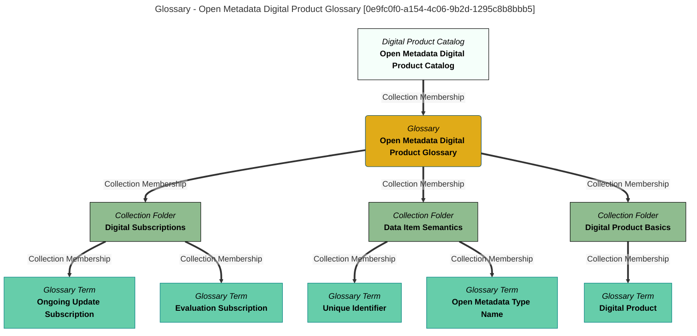

```mermaid
---
title: Glossary - Open Metadata Digital Product Glossary [0e9fc0f0-a154-4c06-9b2d-1295c8b8bbb5]
---
flowchart TD
%%{init: {"flowchart": {"htmlLabels": false}} }%%

1@{ shape: rounded, label: "*Glossary*
**Open Metadata Digital Product Glossary**"}
2@{ shape: rect, label: "*Digital Product Catalog*
**Open Metadata Digital Product Catalog**"}
2==>|"Collection Membership"|1
3@{ shape: rect, label: "*Collection Folder*
**Digital Subscriptions**"}
1==>|"Collection Membership"|3
4@{ shape: rect, label: "*Glossary Term*
**Ongoing Update Subscription**"}
3==>|"Collection Membership"|4
5@{ shape: rect, label: "*Glossary Term*
**Evaluation Subscription**"}
3==>|"Collection Membership"|5
6@{ shape: rect, label: "*Collection Folder*
**Data Item Semantics**"}
1==>|"Collection Membership"|6
7@{ shape: rect, label: "*Glossary Term*
**Unique Identifier**"}
6==>|"Collection Membership"|7
8@{ shape: rect, label: "*Glossary Term*
**Open Metadata Type Name**"}
6==>|"Collection Membership"|8
9@{ shape: rect, label: "*Collection Folder*
**Digital Product Basics**"}
1==>|"Collection Membership"|9
10@{ shape: rect, label: "*Glossary Term*
**Digital Product**"}
9==>|"Collection Membership"|10
style 1 color:#000000, fill:#e0ab18, stroke:#004563
style 2 color:#000000, fill:#f5fffa, stroke:#000000
style 3 color:#000000, fill:#8fbc8f, stroke:#000000
style 4 color:#000000, fill:#66cdaa, stroke:#008080
style 5 color:#000000, fill:#66cdaa, stroke:#008080
style 6 color:#000000, fill:#8fbc8f, stroke:#000000
style 7 color:#000000, fill:#66cdaa, stroke:#008080
style 8 color:#000000, fill:#66cdaa, stroke:#008080
style 9 color:#000000, fill:#8fbc8f, stroke:#000000
style 10 color:#000000, fill:#66cdaa, stroke:#008080
```
